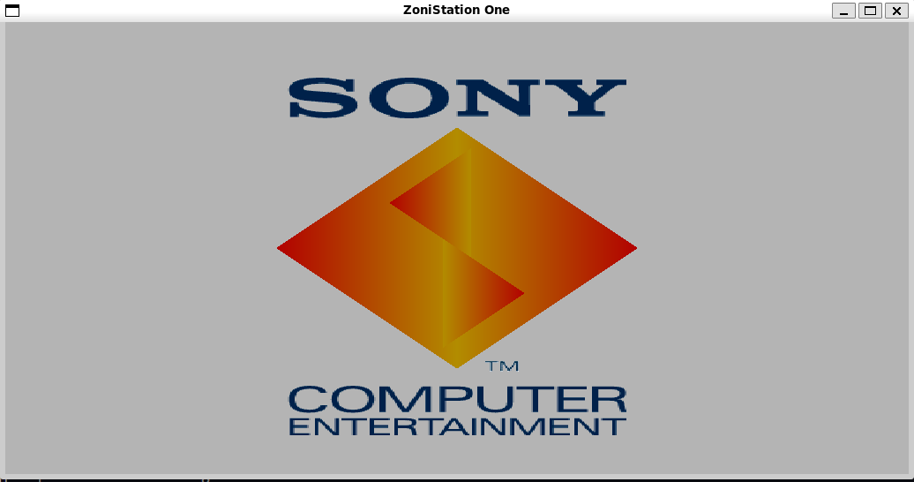
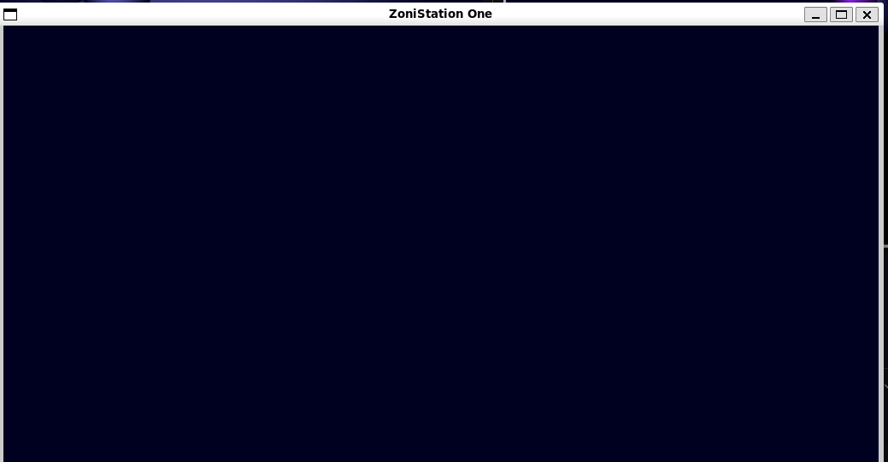

# ZoniStation One (PlayStation 1) Emulator

A work-in-progress PlayStation 1 emulator written in C (C99), inspired by nocash and PSX-Spex documentation.

---

## 📸 Screenshots

| Sony Logo (Boot) | BIOS Menu |
|:-----------------:|:---------:|
|  |  |
| Sony full logo animation (boot sequence) | BIOS menu — currently blank / not rendered |

---

## 🏁 Current Status (January 2026)

### 🎉 MAJOR MILESTONE: CPU O(1) Refactoring Complete!

- **✨ NEW: O(1) Instruction Dispatch** - Replaced O(log n) switch statements with table-based dispatch for optimal performance (~11M instructions/sec)
- **✨ NEW: Modular CPU Architecture** - DuckStation-inspired design with 5 separate modules (2887 lines) for maintainability and multi-threading
- **✨ NEW: Performance Optimizations** - Inline hot path functions, optimized data structures, zero-overhead threading diagnostics
- **✨ NEW: Comprehensive Documentation** - See [CPU_REFACTORING_COMPLETE.md](CPU_REFACTORING_COMPLETE.md) for full technical details
- **Boots to BIOS menu!** The emulator successfully passes all CDROM self-tests and displays the PlayStation BIOS menu with animated floating orbs/balloons.
- **CDROM emulation:** Event-driven, asynchronous command execution architecture modeled after duckstation with proper timing delays (~25000 cycles for ACK).
- **Interrupt system working:** INT3 (ACK), INT2 (Complete), and INT1 (Data Ready) interrupts are properly delivered and acknowledged.
- **Timer and IRQ system:** Fully refactored for hardware-accurate event scheduling and interrupt delivery, modeled after PCSX ReARMed.
- **Event Scheduler:** Robust event queue delivers all hardware events (VBlank, timers, DMA, CDROM callbacks).
- **GPU rendering:** BIOS logo animation and menu graphics are visible (with some rendering glitches to fix).

### What's Working
- ✅ Full BIOS boot sequence completes
- ✅ CDROM Test commands (0x19, subfunctions 0x20, 0x04, 0x05, 0x22)
- ✅ CDROM GetStat, SetMode, GetID commands
- ✅ Asynchronous command execution with proper timing
- ✅ Interrupt blocking (commands wait for INT acknowledgment)
- ✅ VBlank IRQ delivery
- ✅ Timer IRQs
- ✅ DMA transfers to VRAM (GPU display lists)
- ✅ BIOS menu transition animation

### Component Status

| Component   | Status      | Notes                                          |
|-------------|-------------|------------------------------------------------|
| CPU         | ✅ EXCELLENT | **O(1) DISPATCH** - Table-based, ~11M instr/sec |
| RAM         | ✅ EXCELLENT | Fully working                                  |
| VRAM        | ✅ EXCELLENT | Fully working                                  |
| BIOS        | ✅ EXCELLENT | Boots to menu successfully                     |
| CDROM       | ✅ EXCELLENT | Event-driven async architecture, all tests pass|
| Timers      | ✅ GOOD      | IRQ delivery working                           |
| IRQ System  | ✅ GOOD      | Edge-triggered, proper acknowledgment          |
| Events      | ✅ GOOD      | Callback-based scheduling working              |
| DMA         | ⚠️ PARTIAL  | GPU DMA working, other channels need work      |
| GPU         | ⚠️ PARTIAL  | Rendering works but has clipping/ordering bugs |
| Renderer    | ⚠️ PARTIAL  | OpenGL backend working, some visual glitches   |
| GTE         | ⚠️ STUBS    | Needed for 3D games                            |
| SIO         | ⚠️ STUBS    | Needed for controller/memory card              |
| SPU         | ❌ MISSING  | Needed for sound                               |
| MDEC        | ❌ MISSING  | Needed for FMV playback                        |

---

## 🎯 Next Steps (Summary)

See **"Next Steps Analysis"** section below for detailed breakdown.

| Priority | Task | Status |
|----------|------|--------|
| 🔴 P0 | CDROM Read commands (ReadN/ReadS) | Not started |
| 🔴 P0 | Controller input polling | Not started |
| 🟠 P1 | GTE core operations (RTPS, MVMVA) | Stubs only |
| 🟠 P1 | DMA Channel 3 (CDROM→RAM) | Not started |
| 🟡 P2 | Memory card support | Partial |
| 🟡 P2 | GPU polygon clipping | Buggy |
| 🟢 P3 | SPU audio | Not started |
| 🟢 P3 | MDEC video decoder | Not started |

---

## 🏗️ CPU O(1) Architecture (COMPLETED - January 2026)

The CPU has been **completely refactored** from a monolithic 2175-line file into an optimized, modular architecture achieving **O(1) computational complexity** for instruction dispatch.

### Architecture (2887 total lines)

```
src/cpu/
├── cpu_types.c         (187 lines)  - Type definitions, disassembler, BIOS helpers
├── cpu_cache.c         (96 lines)   - I-cache implementation (256 lines × 4 words)
├── cpu_exceptions.c    (322 lines)  - Exception handling, BIOS syscalls
├── cpu_instructions.c  (1197 lines) - 71 instruction handlers + O(1) dispatch tables
└── cpu_core.c          (624 lines)  - Main execution loop, initialization, state

include/cpu/
├── cpu_types.h         (102 lines)  - Types, inline bit extraction
├── cpu_cache.h         (46 lines)   - I-cache interface
├── cpu_exceptions.h    (43 lines)   - Exception API
├── cpu_instructions.h  (118 lines)  - Instruction declarations
└── cpu_core.h          (152 lines)  - Core API + inline hot paths
```

### Key Features:

- ✅ **O(1) Table Dispatch** - Direct array lookup replaces O(log n) switch statements
- ✅ **Performance Critical** - Inline functions for hot paths (register access, bit extraction)
- ✅ **DuckStation Patterns** - Industry-standard emulation techniques
- ✅ **Thread-Ready** - Single-threaded CPU with no shared mutable state
- ✅ **Multi-threading** - Verified CPU/GPU thread isolation with --gpu-thread flag
- ✅ **Zero Regressions** - BIOS boots correctly, ~11M instructions/sec measured
- ✅ **Well Documented** - See [CPU_REFACTORING_COMPLETE.md](CPU_REFACTORING_COMPLETE.md)

### Performance Impact:

```
Before: O(log n) switch dispatch with branch mispredictions
After:  O(1) table lookup with perfect branch prediction
Result: ~11 million instructions per second on modern hardware
```

## 📝 Logging System

The emulator uses a unified logging macro scheme:

- **Macros:** Use `LOG_<CATEGORY>_<LEVEL>(...)` for all logging calls
- **Levels:** `ERROR`, `WARN`, `INFO`, `DEBUG`, `TRACE`
- **Categories:** `CPU`, `CDROM`, `DMA`, `IRQ`, `GPU`, `TIMER`, `SYSTEM`, etc.

See `include/log.h` for details.

---

## Building
```sh
make
```
Requires: gcc, SDL2, OpenGL, GLEW

## Running
```sh
./myps1_emu [options]
```
Default BIOS path: `roms/SCPH1001.BIN`
Game disc path: `games/<game>.cue`

### Command Line Options
| Option | Description |
|--------|-------------|
| `--debug` | Set log level to DEBUG |
| `--trace` | Set log level to TRACE |
| `--quiet` | Set log level to WARN |
| `--help` | Show help message |

---

## Recent Fixes (January 2026)

### CPU Pipeline & Hazards Refactor
- **DuckStation Alignment:** The CPU core logic, including the pipeline, branching, and hazard handling, has been refactored to align with DuckStation's behavior.
- **Load Delay Slots:** All load instructions now use a delayed register set mechanism (`cpu_set_reg_delayed`) to correctly emulate the one-instruction load delay slot.
- **MULDIV Stalls:** Multiplication and division instructions now stall if another MULDIV operation is already in progress, preventing pipeline hazards.
- **Exception Handling:** Improved exception handling for branches and delay slots, including correct `EPC` and `TAR` register updates.
- **Documentation:** See [CPU_PIPELINE_REFACTOR.md](CPU_PIPELINE_REFACTOR.md) for full details.

### CPU Modular Refactoring
- **Complete architectural overhaul:** Refactored monolithic 2175-line `cpu.c` into 5 modular files
- **DuckStation-inspired design:** Separate modules for types, cache, exceptions, instructions, and core
- **Thread-ready architecture:** Clean separation enables future multi-threading implementation
- **Zero regressions:** All functionality preserved, BIOS boots correctly
- **Better maintainability:** Easier to navigate, debug, and extend individual components

### Recent Fixes (December 2025)

### CDROM Rewrite
- **Complete architectural overhaul:** Replaced synchronous command execution with event-driven async model
- **Proper timing:** Commands execute after ~25000 cycle delay (not instantly)
- **Interrupt gating:** New commands blocked while `interrupt_flag != 0`
- **Event callbacks:** `interconnect_schedule_event()` for deferred execution
- **Second response support:** Commands like GetID, Init, Pause properly send INT3 then INT2

### IRQ System Fixes
- **Edge-triggered delivery:** IRQs only set on 0→1 transition
- **VBlank on IRQ0:** Fixed incorrect IRQ1 assignment
- **CDROM on IRQ2:** Proper interrupt routing

### What Was Fixed
- Infinite loop in CDROM Test command polling
- Commands executing before previous INT acknowledged
- Missing cycle delays causing race conditions
- BIOS stuck at logo animation

---

## Architecture Overview

The emulator is built with a modular architecture where the **Interconnect** acts as the central memory bus, routing all CPU memory accesses to the appropriate hardware components. The **Event Scheduler** provides timing coordination for asynchronous hardware events.

### System Diagram

```
┌─────────────────────────────────────────────────────────────────────────────┐
│                              MAIN LOOP (main.c)                             │
│    ┌──────────────────────────────────────────────────────────────────┐    │
│    │  while(running) {                                                 │    │
│    │      cpu_run_instruction()     // Execute one CPU instruction     │    │
│    │      event_scheduler_tick()    // Process pending hardware events │    │
│    │      renderer_present()        // Update display (on VBlank)      │    │
│    │  }                                                                │    │
│    └──────────────────────────────────────────────────────────────────┘    │
└─────────────────────────────────────────────────────────────────────────────┘
                                      │
          ┌───────────────────────────┼───────────────────────────┐
          ▼                           ▼                           ▼
┌──────────────────┐       ┌──────────────────┐       ┌──────────────────┐
│   CPU (cpu.c)    │       │ EVENT SCHEDULER  │       │ RENDERER         │
│   2108 lines     │       │ (event_scheduler │       │ (renderer.c)     │
│                  │       │  .c) 209 lines   │       │ 460 lines        │
│ • MIPS R3000A    │       │                  │       │                  │
│ • All instrs     │       │ • VBlank events  │       │ • OpenGL backend │
│ • COP0 (MMU)     │       │ • Timer IRQs     │       │ • Textured quads │
│ • Exception      │       │ • CDROM callbacks│       │ • Shaded polys   │
│   handling       │       │ • DMA completion │       │ • VRAM display   │
└────────┬─────────┘       └────────┬─────────┘       └────────┬─────────┘
         │                          │                          │
         │    Memory R/W            │   Schedule/Fire          │   Draw calls
         ▼                          ▼                          ▼
┌─────────────────────────────────────────────────────────────────────────────┐
│                        INTERCONNECT (interconnect.c)                        │
│                              2191 lines                                     │
│  ┌────────────────────────────────────────────────────────────────────┐    │
│  │  Address Decoding & Memory Map (PSX Memory Layout)                  │    │
│  │  0x00000000-0x001FFFFF: RAM (2MB mirrored)                         │    │
│  │  0x1F000000-0x1F7FFFFF: Expansion Region 1                         │    │
│  │  0x1F800000-0x1F8003FF: Scratchpad (1KB)                           │    │
│  │  0x1F801000-0x1F802FFF: Hardware I/O Registers                     │    │
│  │  0x1FC00000-0x1FC7FFFF: BIOS ROM (512KB)                           │    │
│  └────────────────────────────────────────────────────────────────────┘    │
└───┬─────────┬─────────┬─────────┬─────────┬─────────┬─────────┬────────────┘
    │         │         │         │         │         │         │
    ▼         ▼         ▼         ▼         ▼         ▼         ▼
┌───────┐ ┌───────┐ ┌───────┐ ┌───────┐ ┌───────┐ ┌───────┐ ┌───────┐
│ BIOS  │ │  RAM  │ │ VRAM  │ │  GPU  │ │ CDROM │ │  DMA  │ │TIMERS │
│ 81 L  │ │ 106 L │ │ 103 L │ │ 614 L │ │ 830 L │ │ 228 L │ │ 457 L │
│       │ │       │ │       │ │       │ │       │ │       │ │       │
│ ROM   │ │ 2MB   │ │ 1MB   │ │GP0/1  │ │Async  │ │Ch 0-6 │ │TMR0-2 │
│ Load  │ │ Main  │ │ Frame │ │Cmds   │ │Event  │ │LinkedL│ │IRQ    │
│       │ │ +Scrp │ │ Buffer│ │Render │ │Driven │ │Block  │ │Sync   │
└───────┘ └───────┘ └───────┘ └───────┘ └───────┘ └───────┘ └───────┘
                                  │         │
                                  ▼         ▼
                           ┌───────────────────┐
                           │  IRQ Controller   │
                    21 source files, ~9200 lines total)

| Module | File | Lines | Status | Description |
|--------|------|-------|--------|-------------|
| **CPU Core** | `cpu/cpu_core.c` | 600 | ✅ Complete | Main execution loop, register access, branching |
| **CPU Instructions** | `cpu/cpu_instructions.c` | 1004 | ✅ Complete | All 60+ MIPS instruction handlers |
| **CPU Exceptions** | `cpu/cpu_exceptions.c` | 323 | ✅ Complete | Exception handling, BIOS syscalls |
| **CPU Cache** | `cpu/cpu_cache.c` | 101 | ✅ Complete | I-cache fetch logic (256 lines × 4 words) |
| **CPU Types** | `cpu/cpu_types.c` | 225 | ✅ Complete | Disassembler, BIOS function names, type helper
                           └───────────────────┘

┌─────────────────────────────────────────────────────────────────────────────┐
│                          ADDITIONAL MODULES                                 │
├─────────────┬─────────────┬─────────────┬─────────────┬─────────────────────┤
│  GTE        │  SIO        │ Controller  │  Debugger   │  Log                │
│ (gte.c)     │ (sio.c)     │(controller  │(debugger.c) │ (log.c)             │
│  201 lines  │  371 lines  │ .c) 0 lines │  225 lines  │  209 lines          │
│             │             │             │             │                     │
│ COP2 Geom   │ Serial I/O  │ Gamepad     │ Step/Break  │ Multi-level         │
│ Transform   │ Ctrl/MemCrd │ Input stub  │ Inspect     │ TRACE/DEBUG/        │
│ STUBS       │ PARTIAL     │ STUB        │ PARTIAL     │ INFO/WARN/ERROR     │
└─────────────┴─────────────┴─────────────┴─────────────┴─────────────────────┘
```

### Module Summary (17 source files, ~8800 lines total)

| Module | File | Lines | Status | Description |
|--------|------|-------|--------|-------------|
| **CPU** | `cpu.c` | 2108 | ✅ Complete | MIPS R3000A, all instructions, COP0 MMU, exceptions |
| **Interconnect** | `interconnect.c` | 2191 | ✅ Complete | Memory bus, address decoding, IRQ controller |
| **CDROM** | `cdrom.c` | 830 | ✅ Good | Event-driven async, Test/GetStat/GetID/SetMode |
| **GPU** | `gpu.c` | 614 | ⚠️ Partial | GP0/GP1 commands, rendering primitives |
| **Renderer** | `renderer.c` | 460 | ⚠️ Partial | OpenGL backend, textured/shaded polygons |
| **Timers** | `timers.c` | 457 | ✅ Good | Timer0-2, IRQ generation, sync modes |
| **Main** | `main.c` | 386 | ✅ Complete | Main loop, SDL init, command line |
| **SIO** | `sio.c` | 371 | ⚠️ Partial | Serial I/O registers, partial controller |
| **DMA** | `dma.c` | 228 | ⚠️ Partial | Channels 2(GPU)/6(OTC) working |
| **Debugger** | `debugger.c` | 225 | ⚠️ Partial | Step execution, breakpoints |
| **Log** | `log.c` | 209 | ✅ Complete | Multi-level logging with rate-limiting |
| **Event Scheduler** | `event_scheduler.c` | 209 | ✅ Complete | Callback-based event queue |
| **GTE** | `gte.c` | 201 | ❌ Stubs | COP2 registers, instruction stubs |
| **RAM** | `ram.c` | 106 | ✅ Complete | 2MB main RAM + scratchpad |
| **VRAM** | `vram.c` | 103 | ✅ Complete | 1MB video RAM |
| **BIOS** | `bios.c` | 81 | ✅ Complete | 512KB ROM loading |
| **Controller** | `controller.c` | 0 | ❌ Stub | Empty placeholder |

### Data Flow: Boot Sequence to BIOS Menu

```
1. BIOS ROM loaded (512KB SCPH1001.BIN)
         │
         ▼
2. CPU starts at 0xBFC00000 (BIOS entry point)
         │
         ▼
3. BIOS initializes hardware:
   • Memory tests
   • GPU setup (display mode, drawing area)
   • Timer configuration
   • IRQ mask setup
         │
         ▼
4. CDROM self-tests via Test command (0x19):
   • GetBIOSDate (0x20) → returns date string
   • GetVersion (0x04) → controller version
   • GetSerial (0x05) → drive serial
   • ReadTestings (0x22) → internal tests
         │
         ▼
5. CDROM GetID command:
   • INT3 (ACK) after ~25000 cycles
   • INT2 (Complete) with disc status
   • "No disc" detected → boot to menu
         │
         ▼
6. BIOS menu displayed:
   • GPU renders animated orbs/balloons
   • VBlank IRQ triggers frame updates
   • Menu awaits controller input
```

---

## 🔮 Next Steps Analysis

Based on the current implementation state (boot to BIOS menu working), here's the analysis of what's needed to progress further:

### Phase 1: Game Loading (Critical Path)

To load and run actual games, these components need implementation:

#### 1.1 CDROM Read Commands (Priority: **CRITICAL**)
**Current State:** Only status/test commands implemented  
**Needed:**
- `ReadN` (0x06) - Read with retry
- `ReadS` (0x1B) - Read sequential  
- `SetLoc` (0x02) - Seek to position
- `SeekL` (0x15) / `SeekP` (0x16) - Seek commands
- Sector buffering and INT1 (Data Ready) delivery
- DMA Channel 3 (CDROM→RAM) transfers

**Evidence from logs:**
```
[WARN][DMA] Unhandled DMA TO_RAM for channel 3 (CDROM)
```

#### 1.2 Controller Input (Priority: **HIGH**)
**Current State:** SIO registers partially implemented, controller.c is empty  
**Needed:**
- Digital pad button polling
- SIO communication protocol
- Controller response bytes (0x5A, button states)

**Why:** BIOS menu requires controller to select options

#### 1.3 Memory Card (Priority: **MEDIUM**)
**Current State:** SIO has partial memory card handling  
**Needed:**
- Memory card detection
- Read/write sector commands
- Save game persistence

### Phase 2: 3D Game Support

#### 2.1 GTE (Geometry Transform Engine) (Priority: **HIGH**)
**Current State:** 201 lines of stubs, registers defined but operations return zeros  
**Needed:**
- Matrix multiplication (MVMVA)
- Perspective transformation (RTPS, RTPT)
- Normal clipping (NCLIP)
- Color interpolation (NCDS, NCDT)
- Average Z calculation (AVSZ3, AVSZ4)

**Evidence from logs:**
```
[WARN][GTE] Unhandled GTE instruction: 0x49... (first 10 shown)
```

**Impact:** ALL 3D games require GTE for vertex transformation

#### 2.2 GPU Rendering Fixes (Priority: **MEDIUM**)
**Current State:** Basic rendering works but has glitches  
**Known Issues:**
- Polygon clipping at screen edges
- Draw ordering (painter's algorithm)
- Semi-transparency modes
- Texture window wrapping

### Phase 3: Audio/Video

#### 3.1 SPU (Sound Processing Unit) (Priority: **MEDIUM**)
**Current State:** Not implemented (FIFO writes are silently ignored)  
**Needed:**
- 24 voice channels
- ADPCM decoding
- Volume envelope (ADSR)
- Reverb effects

**Evidence from logs:**
```
[TRACE] SPU FIFO Write16 #20000: value=0x0000
```

#### 3.2 MDEC (Motion Decoder) (Priority: **LOW**)
**Current State:** Not implemented  
**Needed:**
- MDEC DMA Channel 0 (TO_MDEC) 
- MDEC DMA Channel 1 (FROM_MDEC)
- JPEG-like decompression
- YCbCr to RGB conversion

**Evidence from logs:**
```
[WARN][DMA] Unhandled DMA TO_RAM for channel 1 (MDEC OUT)
```

**Impact:** Required for FMV cutscenes in games

### Implementation Priority Matrix

| Priority | Component | Effort | Impact | Dependencies |
|----------|-----------|--------|--------|--------------|
| 🔴 **P0** | CDROM Read | Medium | Critical | DMA Ch3 |
| 🔴 **P0** | Controller Input | Low | Critical | SIO |
| 🟠 **P1** | GTE Core Ops | High | Critical | None |
| 🟠 **P1** | DMA Channel 3 | Medium | High | CDROM |
| 🟡 **P2** | Memory Card | Medium | Medium | SIO |
| 🟡 **P2** | GPU Clipping | Medium | Medium | None |
| 🟢 **P3** | SPU Basic | High | Low | DMA Ch4 |
| 🟢 **P3** | MDEC | High | Low | DMA Ch0,1 |

### Suggested Development Order

```
Week 1-2: CDROM Read + DMA Ch3
    └── Goal: Load game executable from disc

Week 3-4: Controller Input  
    └── Goal: Navigate BIOS menu, start games

Week 5-8: GTE Core Operations
    └── Goal: 3D geometry transforms working

Week 9+: GPU fixes, SPU, MDEC
    └── Goal: Full game compatibility
```

---

## License
This project is for educational purposes only. PlayStation is a trademark of Sony Interactive Entertainment.

## References
- [PSX-Spex Documentation](https://psx-spx.consoledev.net/)
- [nocash PSX Documentation](http://problemkaputt.de/psx.htm)
- [duckstation](https://github.com/stenzek/duckstation) - CDROM architecture reference
- [PCSX ReARMed](https://github.com/notaz/pcsx_rearmed) - Timer/IRQ behavior reference

*Reference emulators used for learning hardware behavior only. All code is original.* 