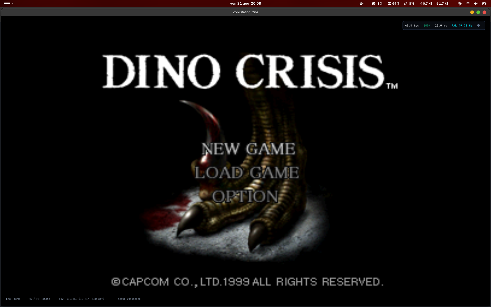
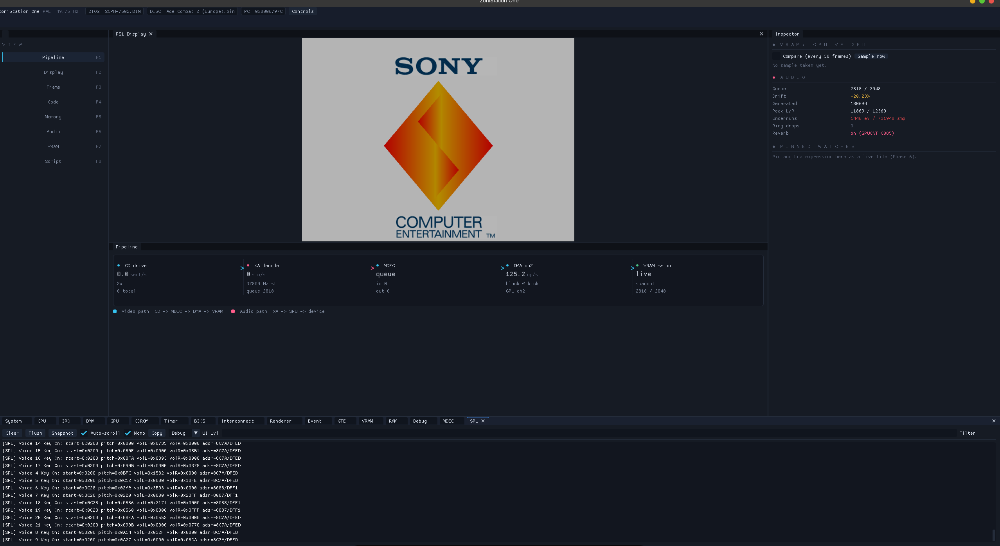
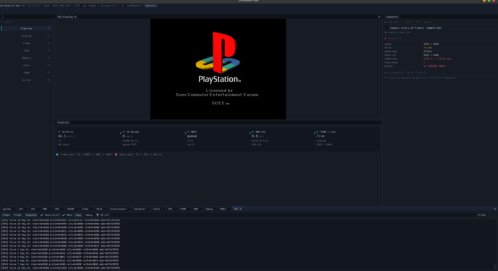
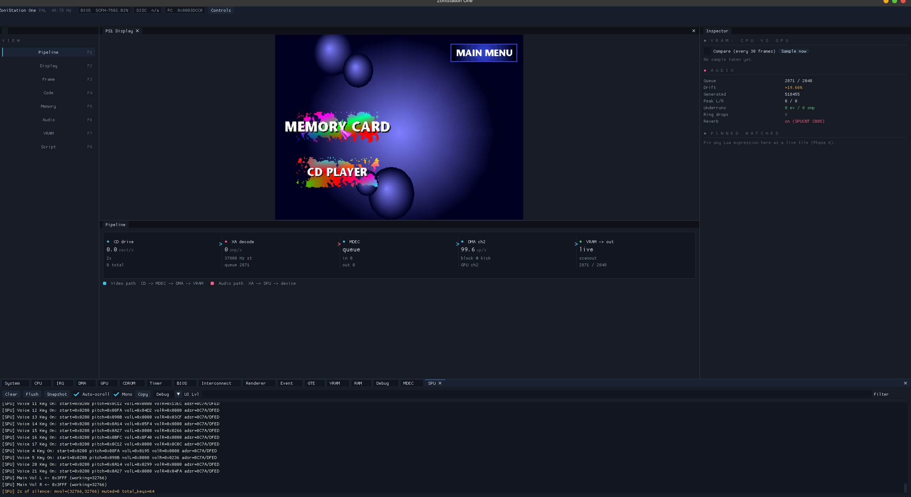
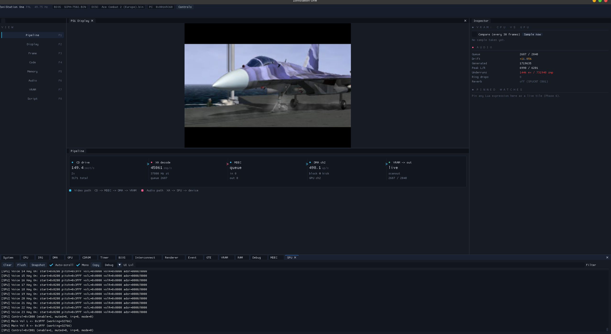
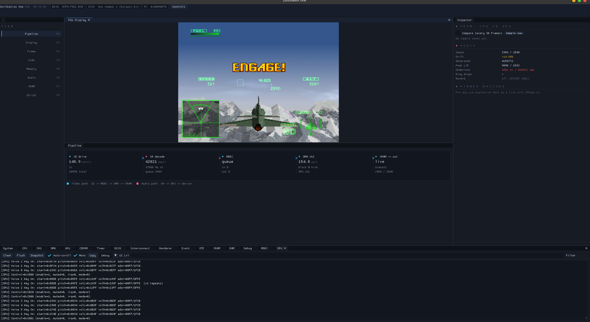

# ZoniStation One

A PlayStation 1 emulator written from scratch in C99, with two interchangeable renderers and a
built-in debugger. Low-level: the real BIOS runs as-is, no syscall is faked, and games boot the way
hardware boots them.

SDL3, an OpenGL 3.3 Core backend (GLEW) and a Vulkan 1.3 backend, ImGui for the debug interface. The
two can be swapped **while a game is running** — the window and the device are rebuilt, VRAM is
carried across as host memory, and the emulated machine never stops. Two commercial discs play
through — boot, FMV, menus, missions, memory-card saves — one of them straight from a compressed
image, and a third boots and runs its engine. That is three games on one machine, not a
compatibility claim.

---

## Screenshots

Power on, BIOS shell, disc boot, movie, mission — and a LibCrypt disc past its protection.









---

## Build

```sh
sudo apt install build-essential libglew-dev libgl1-mesa-dev
make
```

**Vulkan is optional and the build degrades rather than fails without it.** Two things are needed at
compile time — the headers and a shader compiler:

```sh
sudo apt install libvulkan-dev glslang-tools     # vulkan-tools too, for vulkaninfo
```

Missing either one, `make` prints which one it wanted and builds the OpenGL backend alone; the
`Vulkan 1.3` entry in the interface then says so instead of offering a control that cannot work.
Note what is *not* in that list: `libvulkan.so` is never linked. The loader is opened at runtime
through SDL, so the binary starts on a machine with no Vulkan driver at all.

SDL3 is not packaged on Ubuntu 24.04 or its derivatives. Build it once:

```sh
sudo apt install cmake libwayland-dev libxkbcommon-dev libx11-dev libxext-dev libasound2-dev
git clone --depth 1 --branch release-3.2.24 https://github.com/libsdl-org/SDL.git
cmake -S SDL -B SDL/build -DCMAKE_BUILD_TYPE=Release -DSDL_TESTS=OFF -DSDL_EXAMPLES=OFF
cmake --build SDL/build -j"$(nproc)"
sudo cmake --install SDL/build && sudo ldconfig
```

Where SDL3 *is* packaged, `sudo apt install libsdl3-dev` replaces that block. Either way the Makefile
finds it through `pkg-config sdl3`.

ImGui and Lua are vendored in `third_party/`. `make` is parallel by default and tracks header
dependencies, so `make clean` is not needed after editing a header. `make DEBUG=1` gives an `-O0 -g`
build for gdb.

## Run

```sh
./ZoniStation_One roms/bios-pal.bin                          # BIOS menu
./ZoniStation_One roms/bios-pal.bin --game="games/game.bin"  # a disc
```

You supply the BIOS and the discs; neither is in this repository.

### Running your own games

**PAL only for now.** The PAL BIOS (`SCPH-7502`) is what is tested and what the emulated CD drive is
set up to report. A US BIOS boots to its own menu, but no NTSC disc has been run past that.

Three things trip people up, in order of how often:

1. **Pass the `.bin`, not the `.cue`.** `--game=<path>.cue` is accepted and then reports
   *"Disc load failed — BIOS-only mode"*, which reads like a disc problem but is a path problem.
   A `.bin.ecm` is taken directly and decoded on the fly — no need to unpack it first.
2. **The BIOS must match the disc's region**, exactly as on hardware. A PAL disc with a US BIOS is
   rejected and you are left sitting at the BIOS menu, which looks like a boot regression.
3. **The game path needs `--game=`.** A bare positional path is taken as the BIOS path.

### Renderers

Two backends, the same pixels. OpenGL 3.3 is the default; Vulkan 1.3 is there when the build found
its headers and a shader compiler.

```sh
ZS1_GFX=gl      ./ZoniStation_One roms/bios-pal.bin --game="games/game.bin"   # default
ZS1_GFX=vulkan  ./ZoniStation_One roms/bios-pal.bin --game="games/game.bin"
```

Or change it without restarting: **Esc → Video** in the gameplay shell lists both backends and the
GPUs each one offers, says which is running, and switches on the spot. The switch rebuilds the SDL
window and the graphics device — SDL fixes `SDL_WINDOW_OPENGL` and `SDL_WINDOW_VULKAN` when a window
is created and neither can be added later, so a new window is unavoidable — while three things are
carried across it:

- **VRAM**, read back into host memory before the device goes and pushed into the new one after.
  It has to be read from the GPU: `gpu.vram.data` holds what the CPU wrote, never what the
  rasteriser drew.
- **The drawing state** — draw offset, drawing area, texture window, display region, the mask flags.
  These live in the backend, and the guest has no reason to re-send `GP0(E2..E6)` just because the
  host changed graphics API.
- **The ImGui context** — fonts, `imgui.ini`, the docking layout, the pinned watches. Only the two
  backend halves are rebuilt, so the workspace comes back exactly as it was.

The emulated machine is not involved at all: no reset, no save state, and the CPU, the SPU and the
drive never learn that anything happened. If the new backend fails to come up the old one is
rebuilt and the interface says so.

**Picking a GPU** differs between the two, and the interface says which is which rather than hiding
it. Vulkan enumerates real devices and switches between them live. OpenGL cannot: the GLX vendor
library is resolved at the first `dlopen` of libGL, so its two PRIME choices are listed marked
*next launch* and set through `ZS1_GPU` for the run after.

Two platform limits worth knowing before reporting a bug:

- **The OpenGL backend needs X11 here.** Under `SDL_VIDEODRIVER=wayland` GLEW fails to initialise
  ("Unknown error") and the backend refuses to come up — including as the target of a hot switch,
  which then rolls back to Vulkan and says so.
- **Vulkan on an Intel iGPU needs Wayland**, for the opposite reason: with the X screen owned by
  the NVIDIA driver in dGPU mode, `vkCreateSwapchainKHR` returns `VK_ERROR_INITIALIZATION_FAILED`
  even though the surface reports itself supported.

### Controllers

A DualShock 4 over USB or Bluetooth is picked up automatically, hot-plug included, and the keyboard
stays live beside it (`WASD` D-pad, `E C Z X` for △○×□, `Q R` shoulders, `Shift Ctrl` triggers,
`Space` START, `Tab` SELECT).

The emulated pad boots **digital with its LED off**, as a real one does, and waits for its Analog
button. **F12**, or a click on the DS4 touchpad, is that button:

```
digital (ID 41h, LED off) → analog pad (73h, LED red) → analog stick (53h, LED green) → digital
```

The green stick mode is what a few flight titles expect instead of a DualShock, Ace Combat 2 among
them. `ZS1_PAD_MODE=digital|analog|stick` sets the boot mode; the Controller window in the debug UI
shows the current one and cycles it. A game that drives the pad itself through the config commands
overrides all of this, as on hardware.

Booting analog instead was tried, so that the sticks would reach a game without a keypress first. It
costs more than it saves: the BIOS shell's own pad driver does not cope with ID `73h`, never finishes
initialising, and its main menu comes up without a selection cursor. The hardware default is the
default for a reason.

A DS4's light bar shows those colours, so the mode a game selected is visible on the pad. It needs
access to the pad's hidraw node, which is root-only by default; without it SDL uses the kernel evdev
path — buttons, sticks and rumble work, the light bar does not.

```sh
echo 'KERNEL=="hidraw*", ATTRS{idVendor}=="054c", MODE="0660", TAG+="uaccess"' \
  | sudo tee /etc/udev/rules.d/99-sony-hidraw.rules
sudo udevadm control --reload-rules && sudo udevadm trigger
```

Replug the pad afterwards.

Button bits are the same in every region — the pad's bottom button is × (bit 14) and its right button
○ (bit 13) worldwide. What varies is the software: the PS1 shell and Japanese-developed titles confirm
with ○, most Western ones with ×. `ZS1_PAD_SWAP_XO=1`, or the checkbox in the Controller window,
swaps which physical button drives which bit if you prefer × to confirm everywhere.

### Environment variables

| Variable | Effect |
|---|---|
| `ZS1_LOG_LEVEL=silent\|error\|warn\|info\|debug\|trace` | Log level (default `info`; the hot paths are genuinely expensive above it) |
| `ZS1_LOG_STDERR=1` | Also write the log to stderr, not just the in-app windows |
| `ZS1_LUA_SCRIPT=scripts/x.lua` | Run a Lua debug script at startup |
| `ZS1_FRAME_PROFILE=1` | Where each frame's wall-clock time goes, plus cycles per emulated instruction |
| `ZS1_GFX=gl\|vulkan` | Which renderer to start with (default `gl`); also changeable at runtime from **Esc → Video** |
| `ZS1_GPU=nvidia\|intel` | On a hybrid-graphics machine, ask for the discrete or the integrated GPU (OpenGL only — Vulkan picks its device from the interface) |
| `ZS1_VK_VALIDATE=1` | Turn the Vulkan validation layer on, if it is installed |
| `ZS1_GFX_SWITCH_TEST=<n>` | Flip the renderer every `n` fields, for as long as the run lasts — the leak check for the switch path, not something to run normally |
| `ZS1_AUDIO_DUMP=path` | Record what is handed to the sound device, as raw interleaved 16-bit stereo |
| `ZS1_SPU_NO_REVERB=1` | Bypass the reverb stage — an A/B switch when judging an artefact |
| `ZS1_OVERSCAN=0` | Show the 8 display lines an NTSC TV crops at the top and bottom instead of cropping them (PAL is never cropped — it is underscanned already) |
| `ZS1_DMA_GPU_PACE=legacy` | Pace GPU DMA with the old flat quantum instead of the documented 1 clk/word |
| `ZS1_DISPLAY_LATCH=1` | Build each frame from the display state latched at the previous field boundary — an A/B switch, off because it delays the picture a whole field |
| `ZS1_SPU_NO_STRETCH=1` | Bypass the output time-stretch, same purpose |
| `ZS1_DUMP_FRAME=path` | Dump a rendered frame as raw RGB (`ZS1_DUMP_FRAME_N` selects which) |
| `ZS1_TTY_TRACE=1` | Name the BIOS hook behind every captured TTY line |
| `ZS1_PAD_MODE=digital\|analog\|stick` | Pad mode at boot (default `digital`, as on hardware) |
| `ZS1_PAD_SWAP_XO=1` | Report the pad's bottom button as ○ and its right one as × |

`ZS1_GPU` sets the PRIME offload variables the driver stack already reads, before the GL context is
created; setting them by hand works identically. The run always logs which driver it ended up on and
whether the request was honoured — asking for the discrete card and quietly getting the integrated one
is a normal failure, and it is a real source of rendering differences.

---

## Running on a Kubernetes cluster

`deploy/` runs the emulator as a cluster workload: one pod per session, each with a GPU, its own
display and its own memory cards. It was built and verified against a local **k3d** cluster
(`cluster-zs1`, 1 server + 3 workers) on an RTX 4060.

```sh
./deploy/k3d-cuda/create-cluster.sh                 # cluster + GPU device plugin
kubectl apply -f deploy/k3d-cuda/zs1-storage.yaml   # namespace, disks, GPU budget
docker build -f deploy/session/Dockerfile -t zs1/session:dev .
k3d image import zs1/session:dev -c cluster-zs1     # node containerd cannot see the host's images
kubectl apply -f deploy/session/sessions.yaml       # three sessions, three different discs
kubectl port-forward -n zs1 svc/zs1-acecombat 6080:6080
```

### HTTPS, and reaching it from outside

The sessions are published on the tailnet with `tailscale serve`, which terminates TLS with a real
Let's Encrypt certificate and is reachable by tailnet members only — no port forwarding, no public
exposure, and nothing to accept in the browser:

```sh
sudo tailscale serve --bg --https=443   http://acecombat.localhost:8081
sudo tailscale serve --bg --https=8443  http://crash.localhost:8081
sudo tailscale serve --bg --https=10000 http://dino.localhost:8081
```

Three ports because `tailscale serve` offers exactly three for HTTPS, and each proxies to
`<game>.localhost:8081` so Traefik still routes by host and the rate-limit, headers and per-game auth
middlewares stay in the path.

**Enable HTTPS certificates in the tailnet first** (admin console, DNS page). Enabling them after
`tailscaled` has started is not enough on its own: it keeps serving a self-signed certificate from
before the change, and the proxy falls back to it silently rather than reporting anything. Run
`sudo tailscale cert <machine>.<tailnet>.ts.net` once — that path provisions explicitly and prints
the real error if something is wrong.

Another person does not need your account: share the machine from the admin console and they join
with their own free one, seeing that machine and nothing else in your tailnet.

### Starting and stopping

```sh
./deploy/session/start.sh    # cluster, relay, sessions, and the URLs to open
./deploy/session/stop.sh     # stops everything; deletes nothing
```

`stop.sh` stops, it does not delete. The node containers, their volumes, the
cluster's secrets and every memory card under `cluster-data/` survive it. `k3d cluster delete
cluster-zs1` is the destructive form, and it loses the basic-auth and TURN secrets with the cluster.

`start.sh` re-runs `expose.sh` each time rather than trusting the host rules already in the Ingress:
addresses change between sessions, and a rule naming yesterday's DHCP lease resolves to whatever
holds it today.

### Watching a session

Each session publishes three ports. Forward them together — the player page derives the audio port
from the one it is served on (`N` -> `N+1`), so mapping them as a block is what lets several sessions run
side by side:

```sh
kubectl port-forward -n zs1 svc/zs1-acecombat 6080:6080 6081:6081 6082:6082
kubectl port-forward -n zs1 svc/zs1-crash     6090:6080 6091:6081 6092:6082   # a second session
```

| Port | What |
|---|---|
| 6080 | noVNC (picture, and the pages below are served from here) |
| 6081 | audio, WebM/Opus over HTTP |
| 6082 | WebRTC signalling (WebSocket) |

Two ways in, and they are not equivalent:

- **`http://localhost:6080/webrtc.html`** — picture and sound in **one** WebRTC transport, H.264
  encoded on the GPU's NVENC block, keyboard forwarded. This is the one to use. Click *Connect*, then click the picture to
  give it focus before using the keys. The bar shows measured round-trip time, frame rate, bitrate
  and jitter, so latency is read rather than guessed. Add `?sig=6092` for the second session.
- **`http://localhost:6080/play.html`** — the older VNC path: noVNC for the picture, a separate HTTP
  audio stream, an *Enable audio* button. Kept as the fallback, because it depends on nothing but
  x11vnc.

### Through the Ingress

`deploy/session/ingress.yaml` publishes the sessions on one port with Traefik, one hostname each,
behind a rate limit, security headers and basic auth. Each session has its own credential, so one
that leaks costs one session rather than all of them — create them before applying:

```sh
for game in acecombat crash dino; do
  read -rsp "password for $game: " pass; echo
  kubectl create secret generic "zs1-auth-$game" -n zs1 \
    --from-literal=users="$USER_NAME:$(openssl passwd -apr1 "$pass")"
done
kubectl apply -f deploy/session/ingress.yaml
```

Set `USER_NAME` to whatever login you want; it is the same for every session and appears only in the
secret. No credential is stored in this repository — a committed htpasswd hash is a committed
credential — so they live in the cluster and in your password manager, nowhere else. `kubectl delete
cluster` takes them with it and they have to be recreated.

| | |
|---|---|
| `http://acecombat.localhost:8081/webrtc.html` | Ace Combat |
| `http://crash.localhost:8081/webrtc.html` | Crash |

`8081` is where `create-cluster.sh` maps the cluster's port 80; `*.localhost` resolves to 127.0.0.1
without touching `/etc/hosts`. `play.html` works on the same hosts.

**Basic auth is not optional here.** Until this point a session was ClusterIP-only, so reaching one
needed cluster credentials and the read-only BIOS and disc mounts were unreachable from any network.
An Ingress removes that: without the middleware, anyone who can route to the host can drive the
emulated machine. The credential is deliberately *not* in the manifest — a committed htpasswd hash
is a committed credential — so the secret is created separately, as above.

Routing is by host rather than by path because noVNC loads its assets from absolute paths, and a
`/acecombat/` prefix would break every one of them. Each host carries three backends: `/ws` for the
WebRTC signalling socket, `/audio` for the HTTP audio stream, and `/` for noVNC and the pages. The
player pages detect which way they were reached — a path behind the Ingress, a port under
`port-forward` — so both routes work from the same file.

The stream runs at **50 fps**, matching a PAL field. That is a cadence, not a throughput target:
above it the encoder sends duplicate frames, below it real ones are dropped. `ZS1_WEBRTC_FPS` and
`ZS1_WEBRTC_BITRATE_KBPS` override it, `ZS1_WEBRTC=0` and `ZS1_VNC=0` switch either path off.

The pipeline is only built once a viewer connects, so an idle session costs nothing. One viewer at a
time: a second connection replaces the first rather than being multiplexed.

**On the VNC path, audio and picture are not synchronised** — that is what WebRTC is for. VNC carries no sound, so the SPU's output is encoded off
a PulseAudio null sink as WebM/Opus and served on a second port — two transports with nothing tying
their clocks together. What dominates the gap is the browser's own media buffer, which grows without
bound on a progressive stream, so `play.html` chases the live edge: small drift is absorbed by
playing 5% fast, a large one by seeking, and the page shows the measured lag. It lands in the low
hundreds of milliseconds rather than the second-plus it settles at untouched. Real synchronisation
means one transport carrying both, which is the WebRTC work.

---

## Status

| Component | Status | Notes |
|---|---|---|
| CPU (MIPS R3000A) | Working | All instructions, COP0, exceptions, branch delay, a real load delay (the delay-slot opcode reads the old value; a same-register write beats the load; an exception lands it), MULT/DIV and GTE stalls |
| I-Cache | Working | 256 lines × 4 words, tag + per-word valid bits |
| RAM / BIOS ROM | Working | 2 MB + 1 KB scratchpad; SCPH-1001 and SCPH-7502 |
| IRQ controller | Working | Edge-triggered I_STAT/I_MASK, every source wired |
| Event scheduler | Working | Single authority; wrap-safe scheduling |
| DMA | Working | All channels; linked-list and block transfers, completion interrupts |
| Timers 0/1/2 | Working | Derived counters, all sync modes, video-mode-derived clock rates |
| CDROM | Working | Async command/response, region detection, XA audio, drive seek and spin-up timing; a response owes its own deadline, which an interrupt acknowledge or a re-issued command cannot shorten; GetlocL/Pause refuse with 80h during a seek, Setloc validates BCD, and the ATV volume matrix reaches the mix. `.bin` and `.bin.ecm` images, the latter decoded on the fly and verified byte-identical against the container's own whole-file EDC |
| SIO / controllers | Working | DualShock 4 over USB/Bluetooth (the only pad tested), keyboard alongside; digital 41h, analog pad 73h, analog stick 53h, config F3h, both memory card slots |
| GTE | Working | All 22 opcodes with saturation/flags, per-op cycle costs charged to the CPU |
| GPU / renderer | Working | Two backends behind one vtable, swappable while a game runs: **OpenGL 3.3** and **Vulkan 1.3** (dynamic rendering, no render passes). Unified VRAM texture (raster + upload + scanout), 15bpp and 24bpp, VRAM readback for render-to-texture. The two are byte-identical on the frames compared so far |
| MDEC | Working | Full decode pipeline, exercised by real FMV playback |
| SPU / audio | Working | Sample generation on the emulated clock, WSOLA time-stretch on the output |
| Savestates | Working | F5 / F8, whole machine, disc identity checked on load. Format v9 |
| PCDrv | Working | Host filesystem side-channel for homebrew |
| Debugger / UI | Working | Disassembler, breakpoints, watchpoints, exec trace, Lua console |

The machine's three clocks hold nominal: measured over 128 seconds, the CPU runs at 1.0002 of
33.8688 MHz, video at 0.9997 of 50 fields a second, audio at 1.0002 of 44100 samples a second, and the
CD drive streams at the same 150 sectors a second a reference emulator does.

Boot timing is checked the same way, in emulated fields rather than wall clock — every log line
carries the CRTC field count, and a reference emulator's run is put on that axis by counting its
v-blanks. `Ace Combat 2` reaches each of its BIOS TTY milestones within ~2% of the reference, end to
end, and the machine holds 50 fields a second while doing it.

Rendering has two backends and no software renderer. Parity between them is checked by dumping the
same frame from each and comparing the bytes; that has been done at one boot-phase frame so far, not
across a heavy 3D scene. Internal-resolution upscaling on the Vulkan path is designed and not yet
written — every backend still rasterises at the native 1024×512.

### Tested games

Every disc that has been run here, and how far it got. Three titles is not a compatibility list; it
is the whole sample.

| Game | Serial | Image | How far |
|---|---|---|---|
| Ace Combat 2 (Europe) | `SCES-00699` | `.bin` | **Full gameplay.** Boot, FMV intro, textured menus, missions, memory-card saves — played through and stable |
| Disney·Pixar Monsters & Co. — L'Isola dello Spavento (Italy) | `SCES-03765` | `.bin` | Boots, plays both FMV intros, reaches the title screen, starts a new game and runs its 3D engine. Silent during gameplay — the one open bug below |
| Crash Bandicoot 3 — Warped (Europe) | `SCES-01420` | `.bin.ecm` | **Full gameplay**, and the first disc run start to finish from a compressed image |
| Dino Crisis (Europe) | `SLES-02207` | `.bin.ecm` + `.sbi` | Boots past its **LibCrypt** protection, plays the opening screens and reaches the main menu. The first protected disc to run here; it needs its own `.sbi`, and the file must be the same pressing — `SLES-02210` is the Italian release and its patched sectors are elsewhere |

All four are PAL and were run with `SCPH-7502`. Boot milestones from a 35-second run of each, on the
emulated-field axis: `Execute !` at f804, f874 and f843 respectively, with no disc errors.

---

## Known bugs

- **Audio repeats across some scene changes in `Dino Crisis (Europe)`** — a fragment of the previous
  scene's sound plays again as the new one starts. Observed 2026-08-21 in the in-engine 3D cutscenes,
  not in the FMVs.
- **Audio drifts ahead of the in-engine 3D cutscenes in `Dino Crisis (Europe)`.** The sound runs
  faster than the scene it belongs to, so the two come apart as the cutscene goes on. Again only in
  the 3D cutscenes; FMV playback stays in step, which points at the SPU's own clock rather than at
  the XA path or the output device. Neither figure is measured yet: a run with
  `ZS1_FRAME_PROFILE=1`, no stderr logging and no Lua probe comes first, because a guest that is
  slow and a host that cannot keep up look identical here and need opposite fixes.
- **No audio during gameplay and the in-engine 3D cutscenes of `Monsters & Co. (Italy)`.** The FMV
  intros play with their sound, so the XA path and the output device are both fine; it is the SPU
  voice mix that goes quiet once the game is running its own engine.
  `scripts/spu_clip_probe.lua` reports the reverb network's in/out peaks, the rail hits and the XA
  and ring counters in one run, and `ZS1_SPU_NO_REVERB=1` is the one-run A/B.

### Not implemented

Absences rather than defects: no multitap and no DualShock 2 pressure sensing; the CRTC advances once
per frame rather than per scanline, which leaves Timer0's hblank gate unwired; texpage bit 11
(Y base 2) is not applied; and BIOS ROM *data* reads cost nothing, though instruction fetches do pay
their MEMCTRL wait states. Rumble is written against both the one-motor and the `4Dh`-mapped methods
and has never been confirmed against a real pad.

---

## Debug UI

The SDL3 window is an ImGui workspace; nothing goes to the terminal. A **machine bar** carries BIOS,
disc, live PC and the vitals (frame ms, audio-queue depth, drift). A **mode rail** on F1–F8 replaces
what used to be a grid of floating panels:

- **Pipeline** — CD → XA → MDEC → DMA → VRAM on one row with live rates, plus audio meters and a
  CPU-model-vs-GPU-texture VRAM comparison
- **Display** — the emulated screen given the whole stage
- **Frame** — the frame's uploads, batches, DMA completions and XA sectors plotted by CPU cycle
  against the frame budget
- **Code** — disassembly with registers and breakpoints
- **Memory** — hex view over RAM / scratchpad / BIOS
- **Audio** — SPU voices, ADSR and reverb
- **VRAM** — the full 1024×512 with selectable decode (4/8/16/24 bpp), CLUT picking, mask and
  greyscale views, the active display area outlined, zoom, pan and a per-pixel readout
- **Script** — the Lua console; `emu.*` reads live internals a memory dump cannot show. Probes live in
  `scripts/`

F10 run/pause, F11 step, F5/F8 save and load state, Alt+Enter fullscreen. Space is the pad's START
button, not pause.

---

## Layout

```
src/cpu/      MIPS R3000A: decode, execute, exceptions, I-cache, BIOS syscall side-channel
src/core/     bus, RAM, BIOS, DMA, timers, SIO, MDEC, event scheduler, savestates, Lua surface
src/gpu/      GP0/GP1 command handling, VRAM, and the renderer:
                renderer.c     dispatch onto the live backend
                renderer_gl.c  the OpenGL 3.3 backend
                vk/            the Vulkan 1.3 backend
                shaders/       GLSL sources, compiled to SPIR-V at build time
src/gte/      the 22 GTE operations
src/cdrom/    controller, commands, disc images, XA/CDDA audio
src/spu/      24 voices, ADSR, reverb, DMA, IRQ, time-stretch
src/main.c    host shell: SDL, GL context, audio device, threads, frame pacing
src/debug_ui.cpp  the ImGui interface (the only C++ in the tree)
```

Design notes worth knowing before changing anything:

- The **SPU ring is the machine's clock**. The emulation loop runs ahead only until the ring is full
  enough, so anything that changes how fast the ring drains changes how fast the whole machine runs.
- **VRAM is one texture** — a GL texture or a `VkImage` — that is simultaneously the render target,
  the upload target and the scanout source. `gpu.vram.data` is a CPU-side model that never sees
  rasterised pixels, which is why a backend switch has to read VRAM back from the GPU rather than
  re-upload that array.
- **The renderer is reached through a vtable** (`include/gpu_backend.h`). No GL or Vulkan type is
  visible above `renderer.c`; what ImGui gets for a texture is an opaque `GfxTexHandle` that holds a
  GL name on one backend and a `VkDescriptorSet` on the other.
- **The event scheduler is the single timing authority.** Nothing else may schedule work.
- **No `malloc` in hot paths.** Structs are embedded, not heap-allocated.

Memory map, per-subsystem state and the open work queue: `docs/GAP_ANALYSIS_REFACTOR_2026-07-13.md`,
`docs/GPU_GAP_ANALYSIS_2026-07-15.md`, `docs/study/README.md`, and `docs/ui/` for the interface direction.

---

## References

What this emulator was actually written against:

- **psx-spx**, Martin "nocash" Korth's PlayStation specification, [psx-spx.consoledev.net](https://psx-spx.consoledev.net/) —
  the source of nearly every value in the code, cited by file and line as `DOCS/…`.
- **[PCSX-Redux](https://github.com/grumpycoders/pcsx-redux)** (GPL-2.0+) — consulted where the
  specification is ambiguous, and the origin of parts of the SPU; credited in the file headers.
- **[DuckStation](https://github.com/stenzek/duckstation)** — consulted only for *what the hardware
  does*. Its licence forbids derivative works, so none of its code is here.
- **Lionel Flandrin's PlayStation Emulation Guide** ([simias/psx-guide](https://github.com/simias/psx-guide)) —
  followed while the first subsystems were being built.

None of those documents are redistributed here; the `DOCS/…` citations resolve against a clone you
make yourself (`git clone https://github.com/psx-spx/psx-spx.github.io && ln -s psx-spx.github.io/docs DOCS`).
`THIRD-PARTY.md` is the full account, including the MIT components that *are* vendored.

## License

GPL-3.0-or-later. Every source file carries an SPDX header; `THIRD-PARTY.md` is the inventory of
components with other authors.
