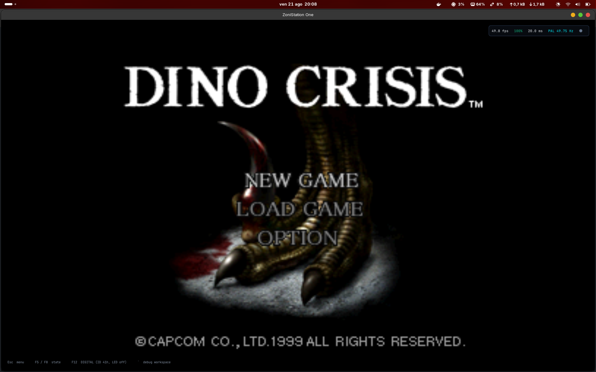
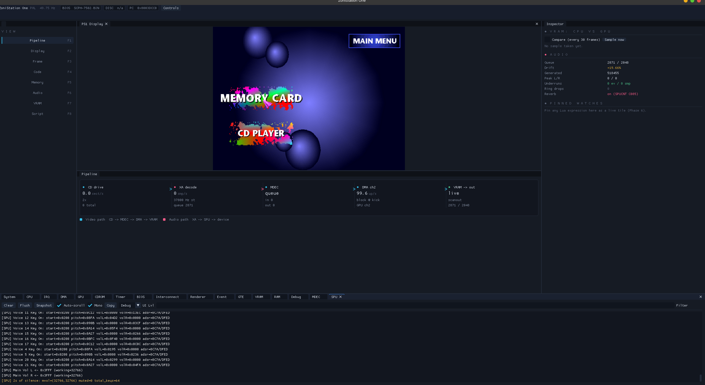
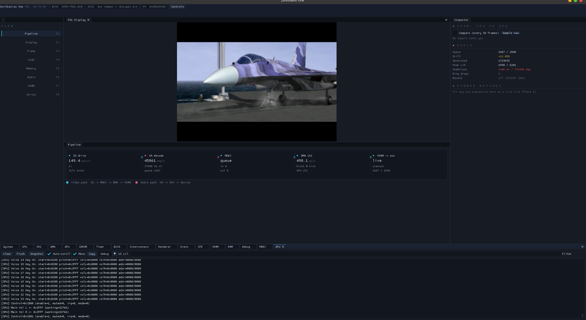
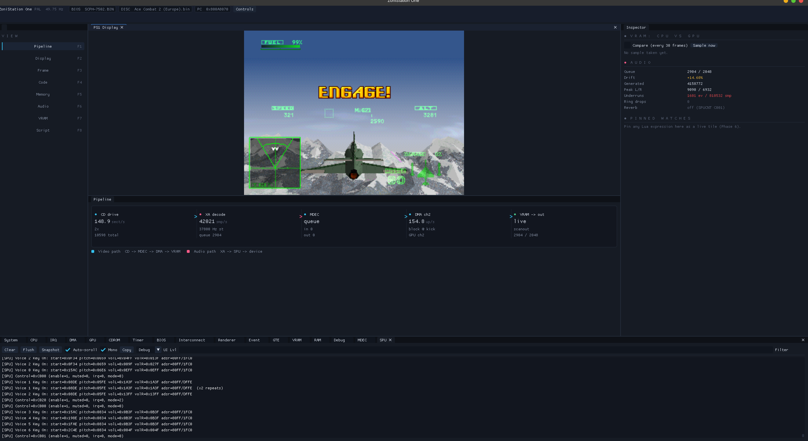

# ZoniStation One

A PlayStation 1 emulator written from scratch in C99, with two interchangeable renderers and a
built-in debugger. Low-level: the real BIOS runs as-is, no syscall is faked, and games boot the way
hardware boots them.

SDL3, an OpenGL 3.3 Core backend (GLEW) and a Vulkan 1.3 backend, ImGui for the interface. The two
renderers can be swapped **while a game is running**: the window and the device are rebuilt, VRAM is
carried across, and the emulated machine never stops. It can also run as a cluster workload, one
pod per session, streamed to a browser (see [docs/CLUSTER.md](docs/CLUSTER.md)).

Two commercial discs play through (Ace Combat 2, Crash Bandicoot 3), a LibCrypt disc runs past its
protection (Dino Crisis), and a fourth boots and runs its 3D engine (Monsters & Co.). Four games on
one machine is a sample, not a compatibility claim.







---

## Build

```sh
sudo apt install build-essential libglew-dev libgl1-mesa-dev
make
```

SDL3 is not packaged on Ubuntu 24.04 or its derivatives. Build it once:

```sh
sudo apt install cmake libwayland-dev libxkbcommon-dev libx11-dev libxext-dev libasound2-dev
git clone --depth 1 --branch release-3.2.24 https://github.com/libsdl-org/SDL.git
cmake -S SDL -B SDL/build -DCMAKE_BUILD_TYPE=Release -DSDL_TESTS=OFF -DSDL_EXAMPLES=OFF
cmake --build SDL/build -j"$(nproc)"
sudo cmake --install SDL/build && sudo ldconfig
```

Where SDL3 is packaged, `sudo apt install libsdl3-dev` replaces that block. The Makefile finds it
through `pkg-config sdl3`. ImGui and Lua are vendored in `third_party/`.

The two submodules (`pcsx-redux/`, `duckstation_ref/`) are reference material and are not needed to
build. `duckstation_ref` is marked `update = none`, so a recursive clone skips it (it is over 1 GB);
fetch it with `git submodule update --init --checkout duckstation_ref` only if you want to check what
the hardware does against it. Nothing from it may be copied (see `.github/CONTRIBUTING.md`).

**Vulkan is optional.** It needs `libvulkan-dev` and `glslang-tools` at compile time; without them
`make` says which one it wanted and builds the OpenGL backend alone. `libvulkan.so` is never linked:
the loader is opened at runtime, so the binary starts on a machine with no Vulkan driver.

Build notes:
- `make` is parallel and tracks header dependencies. `make DEBUG=1` gives an `-O0 -g` build.
- **If the link fails with `LTO version 13.1 instead of the expected 14.0`**, objects from another
  gcc are lying around: `make clean && make`. LTO is switched on for C only when `gcc` and `g++`
  share a major version.
- `make PGO_GEN=1` then `make PGO_USE=1` build a profile-guided binary; `make LOG_MAX_LEVEL=TRACE`
  keeps TRACE logging, which is compiled out otherwise.

### Tests

```sh
make test      # 9 unit test programs, no SDL, BIOS or disc needed
make hwtest    # 16 bare-metal checks run inside the emulator, on OpenGL and on Vulkan
```

`make hwtest` runs small PS-X EXEs on a zero-filled BIOS and needs a MIPS cross compiler and Xvfb
(Mesa's software renderers are enough): `sudo apt install gcc-mipsel-linux-gnu xvfb mesa-vulkan-drivers`.
Each check cites the psx-spx line it rests on. See [tests/hw/README.md](tests/hw/README.md) and
[docs/TESTING_PLAN_2026-08-20.md](docs/TESTING_PLAN_2026-08-20.md). Beyond these, accuracy claims
here were established by running a game and reading its log.

---

## Run

```sh
./ZoniStation_One roms/bios-pal.bin                          # BIOS menu
./ZoniStation_One roms/bios-pal.bin --game="games/game.bin"  # a disc
```

You supply the BIOS and the discs; neither is in this repository. **PAL is what is tested**
(`SCPH-7502`); a US BIOS boots to its own menu, but no NTSC disc has been run past that.

Three things trip people up, most often first:

1. **Pass the `.bin` (or `.bin.ecm`), not the `.cue`.** A `.cue` is accepted and then reports
   *"Disc load failed — BIOS-only mode"*, which reads like a disc problem. `.bin.ecm` is decoded on
   the fly; there is no need to unpack it.
2. **The BIOS must match the disc's region**, as on hardware. A PAL disc under a US BIOS is rejected
   and you sit at the BIOS menu, which looks like a boot regression.
3. **The game path needs `--game=`.** A bare positional path is taken as the BIOS.

A **LibCrypt** disc also needs its `.sbi`, and it must be the same pressing (`SLES-02207` is the
English Dino Crisis, `SLES-02210` the Italian one: the wrong file loads without complaint and the
game hangs). It is found by the image's name beside the image, or set with `ZS1_SBI=<path>`.

Run it from a scratch directory if you care about your memory cards: the emulator writes
`memcard1.mcd`, `memcard2.mcd`, `imgui.ini`, `logs/` and `savestates/` into the current directory,
and rewrites the cards on every boot (the BIOS driver's write test). The first write of a session
copies each card to `<path>.bak`.

### Keys

| | |
|---|---|
| `` ` `` or Shift+F1 | Switch between the gameplay shell and the debug workspace |
| `Esc` | In the gameplay shell, the quick menu (savestate slots, pad mode, video, quit) |
| F5 / F8 | Save / load state in slot 0 (states are version 12; older ones are refused) |
| F10 / F11 | Run or pause / single step |
| F12 | The pad's Analog button: digital, analog, stick |
| Alt+Enter | Fullscreen |
| `WASD` `E C Z X` `Q R` `Shift Ctrl` `Space` `Tab` | D-pad, △○×□, shoulders, triggers, START, SELECT |

A DualShock 4 over USB or Bluetooth is picked up automatically, with hot-plug, and the keyboard
stays live beside it. The pad boots **digital**, as a real one does. Details, the DS4 light bar and
the button swap: [docs/RENDERERS_AND_CONTROLLERS.md](docs/RENDERERS_AND_CONTROLLERS.md).

### Renderers

OpenGL 3.3 is the default. `ZS1_GFX=vulkan` starts on Vulkan; **Esc → Video** switches live and
lists the GPUs each backend offers. How the switch carries VRAM, drawing state and the ImGui
context, and the platform limits (OpenGL needs X11 here, Vulkan on an Intel iGPU needs Wayland):
[docs/RENDERERS_AND_CONTROLLERS.md](docs/RENDERERS_AND_CONTROLLERS.md). On a hybrid-graphics laptop
check the `GL driver in use` line in `logs/System.log` before judging a rendering difference.

### Environment variables

The ones to know first; `CLAUDE.md` lists them all with their history.

| Variable | Effect |
|---|---|
| `ZS1_LOG_LEVEL=silent\|error\|warn\|info\|debug\|trace` | Log level (default `info`). Logs go to `logs/<Category>.log` |
| `ZS1_LOG_STDERR=1` | Also write the log to stderr |
| `ZS1_LUA_SCRIPT=scripts/x.lua` | Run a Lua probe at startup |
| `ZS1_FRAME_PROFILE=1` | Where each frame's time goes, plus cycles per emulated instruction (`CPI=`) |
| `ZS1_GFX=gl\|vulkan`, `ZS1_GPU=nvidia\|intel`, `ZS1_VSYNC=0\|1\|-1` | Renderer, GPU choice on a hybrid machine (OpenGL), swap interval or present mode |
| `ZS1_UI=gameplay\|debug`, `ZS1_UI_SCALE=<f>` | Which shell opens, interface scale |
| `ZS1_PAD_MODE=digital\|analog\|stick`, `ZS1_PAD_SWAP_XO=1` | Boot pad mode, swap × and ○ |
| `ZS1_SBI=<path>` | LibCrypt patch file for the mounted disc |
| `ZS1_AUDIO_DUMP=<path>` | Record what is handed to the sound device (raw 16-bit stereo) |
| `ZS1_DUMP_FRAME=<path>`, `ZS1_DUMP_FRAME_N=<n>` | Dump a rendered frame |
| `ZS1_SPU_NO_REVERB=1`, `ZS1_SPU_NO_STRETCH=1`, `ZS1_SPU_RING_TARGET=<frames>` | A/B switches for the audio path |
| `ZS1_OVERSCAN=0` | Show the 8 lines an NTSC TV crops |
| `ZS1_DMA_STALL=doc`, `ZS1_RAM_LOAD_STALL=<n>`, `ZS1_DMA_GPU_PACE=legacy` | Timing models: documented DMA cost (opt-in, changes emulated timing), RAM load cost, GPU DMA pacing |
| `ZS1_CD_XA_HOLD=1`, `ZS1_MDEC_WRAP9=1`, `ZS1_FORCE_READBACK=1`, `ZS1_DISPLAY_LATCH=1` | Restore the older behaviour of one fix, for an A/B |
| `ZS1_VK_VALIDATE=1`, `ZS1_GFX_SWITCH_TEST=<n>` | Vulkan validation layer, flip the renderer every `n` fields |

**Never quote a speed figure from a run with `ZS1_LOG_STDERR`, debug logging, a Lua probe or a
breakpoint active.** The instrumentation costs more than what it measures.

---

## Status

| Component | State | Notes |
|---|---|---|
| CPU (R3000A), I-cache | Working | Every instruction, COP0, exceptions, real load delay, MULT/DIV and GTE stalls, 256-line cache; BIOS ROM wait states charged |
| Bus, RAM, IRQ, scheduler | Working | One event scheduler is the only timing authority; RAM loads cost 3 cycles, CPI ~1.6 |
| DMA | Working | All channels, linked-list and block, sliced transfers; a documented cost model is opt-in |
| Timers | Working | Derived counters, all sync modes; the CRTC advances per frame, not per scanline |
| CDROM | Working | Async commands with real response deadlines, region check, XA with the documented filter routing, ATV/Mute reach the mix; `.bin` and `.bin.ecm`, LibCrypt via `.sbi` |
| SIO, controllers | Working | DualShock 4 (the only pad tested), digital / analog / stick modes, both memory card slots. Rumble is written but never confirmed on a real pad |
| GTE | Working | All 22 operations with flags and cycle costs |
| GPU, renderer | Working | OpenGL 3.3 and Vulkan 1.3 behind one vtable, swappable live; one VRAM texture, 15 and 24 bpp. Native resolution only, no software renderer |
| MDEC | Working | Full decode pipeline, exercised by real FMV |
| SPU, audio | Working | 24 voices, ADSR, reverb, IRQ and loop rules from the documentation, time-stretched output |
| Savestates | Working | Whole machine, version 12 |
| Debugger, Lua | Working | Disassembler, breakpoints, watchpoints, `emu.*` probes in `scripts/` |
| PCDrv | Working | Host filesystem side-channel for homebrew |
| Cluster | Working | k3d + NVENC + WebRTC, one session per pod: [docs/CLUSTER.md](docs/CLUSTER.md) |

The machine's clocks hold nominal over a long run (CPU, video and audio within 0.05% of nominal,
the CD drive at 150 sectors a second), and a clean Ace Combat 2 run holds 100% of real time with a
host cost of ~3 ms on a 20 ms PAL field. Boot timing is compared with a reference emulator in
*emulated fields*, not wall clock: every log line carries the field count (`[f1397 t 27.4809]`).

### Tested games

| Game | Serial | Image | How far |
|---|---|---|---|
| Ace Combat 2 (Europe) | `SCES-00699` | `.bin` | **Full gameplay**: boot, FMV, menus, missions, memory-card saves |
| Crash Bandicoot 3: Warped (Europe) | `SCES-01420` | `.bin.ecm` | **Full gameplay**, played start to finish from a compressed image |
| Dino Crisis (Europe) | `SLES-02207` | `.bin.ecm` + `.sbi` | Past its **LibCrypt** protection, through the opening and into the first in-engine scenes. Some character voices arrive late (see below) |
| Disney·Pixar Monsters & Co. (Italy) | `SCES-03765` | `.bin` | **Plays**: boot, FMV intros, title, new game, 3D engine, with in-game audio (it was silent before the 2026-10-02 work) |

All four are PAL, run with `SCPH-7502`.

---

## Known issues

- **Dino Crisis: some character voices in the 3D cutscenes still arrive after the ambient sound.**
  The 2026-10-02 work (PR #3) improved it, and this is what is left. Seen 2026-10-03 right at the
  start of the game. The voices are XA from the disc and the stall on a pending
  interrupt is fixed (`int1_audio` stays 0). In the window measured, the first wanted XA sector comes
  ~194 ms after `ReadS`, of which 127 ms is the disc's own 19-sector channel interleave, so that
  window does not explain a large delay. Cause not found. `scripts/cutscene_audio_classify.lua` run
  from a savestate (F5 just before the scene) says which audio mechanism a scene uses. The earlier
  reports of repeated sound at scene changes and of drift were targeted by the 2026-10-02 work and
  have not been re-observed or measured.
That is the only game-level bug known today. Ace Combat 2, Crash Bandicoot 3 and Monsters & Co. play
without a known defect.

### Limits and unverified

Gaps in the hardware model and things that were fixed without a way to confirm them here; none is a
known defect in a tested game.

- **SPU pops during speech** were reported earlier; the cause was never found and it has not been
  reproduced from a fixed point. `scripts/spu_clip_probe.lua` separates saturation from a dropped
  sample if it comes back.
- **Display window comes from GP1(06) in size but its position is ignored**, so screen shake via
  GP1(06)/(07) is invisible, and the overscan crop applies to NTSC only. Display state is latched at
  the end of the field, not per line. Details: `docs/GPU_DISPLAY_STUDY_2026-08-10.md`.
- **Intel iGPU texture artefacts**: a fix is committed and unverified. This machine's context lands
  on the NVIDIA card, so it cannot be checked here.
- **Not implemented:** multitap, DualShock 2 pressure sensing, texpage bit 11, BIOS ROM *data* read
  cost, per-scanline CRTC. The gameplay shell cannot start a disc, swap a disc or reset the console
  yet; the disc comes from `--game=`.
- `WARN XA sequence break` in the CDROM log can be spurious: it compares against a function-level
  `static` that a savestate load does not restore, and it does not know a legitimate change of
  interleave. It is a diagnostic only.

---

## Debug UI

The window has two shells, switched with `` ` `` at any time while the machine keeps running.

- **Gameplay shell**: the emulated screen and nothing else. A HUD (fps, speed, host frame time,
  region, the pad's LED) fades out when idle; `Esc` opens the quick menu.
- **Debug workspace**: a machine bar (BIOS, disc, PC, vitals) and eight modes on F1-F8:
  **Pipeline** (CD → XA → MDEC → DMA → VRAM with live rates), **Display**, **Frame** (events plotted
  by CPU cycle against the budget), **Code** (disassembly, breakpoints), **Memory**, **Audio** (SPU
  voices, ADSR, reverb), **VRAM** (the whole 1024×512 with selectable decode) and **Script** (the Lua
  console). Plus the Host HW panel, a Controller window that draws a DualShock, and the log dock.

Everything shown is read from the machine or the host; nothing is typed in. Debug with the in-tree
Lua probes (`ZS1_LUA_SCRIPT`) rather than dumping state and analysing it outside: they read live
internals a dump cannot show.

---

## Layout

```
src/cpu/      MIPS R3000A: decode, execute, exceptions, I-cache, BIOS syscall side-channel
src/core/     bus, RAM, BIOS, DMA, timers, SIO, MDEC, event scheduler, savestates, Lua surface
src/gpu/      GP0/GP1 handling, VRAM, and the renderer (renderer.c dispatches onto the OpenGL
              backend in renderer_gl.c or the Vulkan backend in vk/; shaders/ compiled to SPIR-V)
src/gte/      the 22 GTE operations
src/cdrom/    controller, commands, disc and ECM images, XA/CDDA audio
src/spu/      24 voices, ADSR, reverb, DMA, IRQ, time-stretch
src/main.c    host shell: SDL, GL context, audio device, threads, frame pacing
src/debug_ui.cpp  the ImGui interface (the only C++ in the tree)
tests/        unit tests (make test); tests/hw/ bare-metal checks (make hwtest)
scripts/      Lua probes
deploy/       k3d cluster, session image, ingress
docs/         studies, audits and design notes
```

Design notes worth knowing before changing anything:

- The **SPU ring is the machine's clock**: the emulation loop runs ahead only until the ring is full
  enough, so anything that changes how fast the ring drains changes how fast the whole machine runs.
- **VRAM is one texture** (a GL texture or a `VkImage`) that is the render target, the upload target
  and the scanout source. `gpu.vram.data` never sees rasterised pixels, which is why a backend
  switch and a savestate read VRAM back from the GPU.
- **The renderer is reached through a vtable** (`include/gpu_backend.h`); no GL or Vulkan type is
  visible above `renderer.c`.
- **The event scheduler is the single timing authority.** No `malloc` in hot paths.

Where to read next:

| | |
|---|---|
| `docs/GAP_ANALYSIS_REFACTOR_2026-07-13.md`, `docs/GPU_GAP_ANALYSIS_2026-07-15.md` | Per-subsystem state and the work queue |
| `docs/CDROM_AUDIT_2026-08-17.md`, `docs/DMA_IRQ_GTE_MDEC_AUDIT_2026-08-17.md` | Audits against the official psx-spx |
| `docs/ANALISI_PERF_AUDIO_FMV_2026-10-02.md`, `docs/PROVE_MANUALI_2026-10-02.md` | The 2026-10-02 performance, audio and FMV work, and the manual checks (Italian) |
| `docs/ui/`, `docs/study/README.md` | Interface direction, CDROM/SPU work queue |
| `CHANGELOG.md`, `CLAUDE.md` | Every change with its source line; the working notes and traps |

---

## Contributing

See [.github/CONTRIBUTING.md](.github/CONTRIBUTING.md): build and test, how evidence is expected, the
licensing rules, and the pull request template. Security reports:
[.github/SECURITY.md](.github/SECURITY.md).

## References

What this emulator was actually written against:

- **psx-spx**, Martin "nocash" Korth's PlayStation specification,
  [psx-spx.consoledev.net](https://psx-spx.consoledev.net/): the source of nearly every value in the
  code, cited by file and line as `DOCS/…`.
- **[PCSX-Redux](https://github.com/grumpycoders/pcsx-redux)** (GPL-2.0+): consulted where the
  specification is ambiguous, and the origin of parts of the SPU; credited in the file headers.
- **[DuckStation](https://github.com/stenzek/duckstation)**: consulted only for *what the hardware
  does*. Its licence forbids derivative works, so none of its code is here.
- **Lionel Flandrin's PlayStation Emulation Guide**
  ([simias/psx-guide](https://github.com/simias/psx-guide)): followed while the first subsystems
  were being built.

None of those documents are redistributed here; the `DOCS/…` citations resolve against a clone you
make yourself
(`git clone https://github.com/psx-spx/psx-spx.github.io && ln -s psx-spx.github.io/docs DOCS`).
`THIRD-PARTY.md` is the full account, including the MIT components that *are* vendored.

## License

GPL-3.0-or-later. Every source file carries an SPDX header; `THIRD-PARTY.md` is the inventory of
components with other authors.
