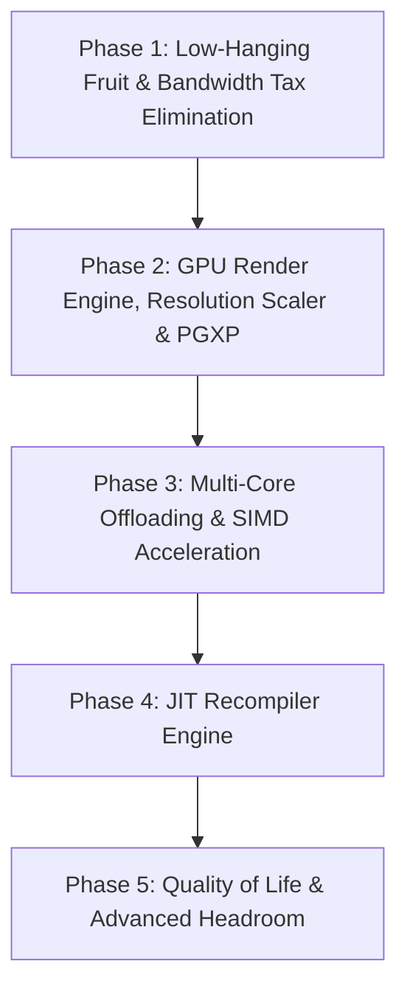

# Hardware Utilization Analysis & Technical Optimization Plan — ZoniStation One

**Date:** 2026-08-01  
**Target Hardware:** Intel Core i9-14900K (24 Cores / 32 Threads) + NVIDIA RTX 4060  
**Scope:** Deep Technical Performance Architecture & Phased Implementation Plan  
**Companion Documents:** [`GAP_ANALYSIS_REFACTOR_2026-07-13.md`](file:///home/antoninoc/Projects/GitHub/ZonistationOne/docs/GAP_ANALYSIS_REFACTOR_2026-07-13.md), [`GPU_GAP_ANALYSIS_2026-07-15.md`](file:///home/antoninoc/Projects/GitHub/ZonistationOne/docs/GPU_GAP_ANALYSIS_2026-07-15.md).

---

> [!IMPORTANT]
> **Copyright, Licensing & Cleanroom Isolation Policy**  
> Technical references in this document to emulators like **DuckStation** (CC BY-NC-ND 4.0 since 2024-09-01, non-commercial) and **PCSX-Redux** (GPL-2.0 repo / GPL-2.0-or-later for the ported SPU files) refer exclusively to **industry-standard computer science concepts** (e.g., JIT basic block translation, internal resolution upscaling, PGXP float precision geometry transformation, SIMD vectorization, and dirty region tracking).  
> **Source policy:** DuckStation code is **never** copied or incorporated — it is consulted for behaviour only (the submodule is pinned for that purpose and its licence forbids derivative works). What the tree *does* incorporate is the GPL-2.0+ code credited in the file headers and in `THIRD-PARTY.md` — the 1:1 pcsx-redux ports (`src/spu/spu_voice.c`, `src/spu/spu_adsr.c`, `src/spu/spu.c`), the PCSX ReARMed-inspired timer scheduling (`src/core/timers.c`), and the pcsx-redux-mirroring decode tables (`src/cpu/cpu_decode.c`) — all compatible with the project's GPL-3.0-or-later and attributed in place. Everything else is written independently from public hardware specifications (`DOCS/`).

---

## 1. Executive Summary & Host Baseline

ZoniStation One currently executes as a **single-threaded CPU interpreter rendering at native PSX resolution (1024×512 VRAM)**.

### Host Machine Utilization Today
- **CPU (i9-14900K, 24C / 32T):** ~2-4% total host load. The **emulation core is single-threaded** — **1 thread** drives all system components sequentially inside `system_run_frame()` ([`main.c:450`](file:///home/antoninoc/Projects/GitHub/ZonistationOne/src/main.c#L450)): CPU instruction decode, bus I/O, GPU command recording, SPU sample generation, MDEC macroblock decode, and CD-ROM logic. Separate threads run the GL renderer and the CD reader, so the remaining ~29 host threads are idle.
- **GPU (RTX 4060, 3072 ALUs):** ~1% load. Renders a native 1024×512 quad via OpenGL with `GL_NEAREST` filtering, no internal upscaling, no PGXP geometry correction, no custom display shaders, and VSync disabled (`SetSwapInterval(0)`).
- **PCI-e & Cache Bandwidth Tax:** Heavy per-instruction memory copies (`memcpy` of 128-byte register structures) and full 2 MB VRAM staging uploads every frame, regardless of whether VRAM was modified.

---

## 2. Architectural Paradigm Analysis (Cleanroom Engineering)

Modern PlayStation emulators leverage specific architectural paradigms to convert idle CPU/GPU resources into performance headroom and visual fidelity:

```
┌────────────────────────────────────────────────────────────────────────────┐
│                              EMULATION CORE                                │
│   Interpreter (Reference/Debug)   │   JIT Recompiler (x86_64 Fast Path)    │
└─────────────────────────────────────┬──────────────────────────────────────┘
                                      │
         ┌────────────────────────────┼────────────────────────────┐
         ▼                            ▼                            ▼
┌──────────────────┐        ┌──────────────────┐        ┌──────────────────┐
│ WORKER POOL      │        │ GPU RENDER ENGINE│        │ SPU AUDIO ENGINE │
│ - Multi-Threaded │        │ - Scaled FBO     │        │ - AVX2 8-Lane    │
│   MDEC Decode    │        │   (2x - 8x)      │        │   Voice Mix      │
│ - AVX2 IDCT &    │        │ - PGXP Subpixel  │        │ - Async Sample   │
│   YUV Color Space│        │   Float Precision│        │   Ring Drain     │
└──────────────────┘        └──────────────────┘        └──────────────────┘
```

1. **JIT Dynamic Recompilation:** Translates MIPS R3000A basic blocks into host x86_64 machine code, caching blocks and linking branches directly (block chaining) to eliminate interpreter dispatch overhead.
2. **Workload Offloading:** Moves decoupled, compute-heavy tasks (MDEC video decoding, SPU voice mixing) onto background worker threads.
3. **Hardware Texture & Geometry Scaling:** Renders graphics to high-resolution framebuffers (2x-8x native) and intercepts GTE coordinates for floating-point precision (PGXP).
4. **Dirty Region Tracking:** Replaces full-frame VRAM uploads with precise bounding-box transfers.

---

## 3. Detailed Phased Implementation Plan



---

### Phase 1: Zero-Risk Low-Hanging Fruit & Bandwidth Tax Elimination (Near-Term)

**Objective:** Reclaim immediate single-core CPU headroom and remove redundant per-instruction/per-frame memory bandwidth overhead.

#### 1.1 Interpreter Dispatch & Register Commit Overhaul
- **Problem:** [`cpu_execution.c:101`](file:///home/antoninoc/Projects/GitHub/ZonistationOne/src/cpu/cpu_execution.c#L101) performs `memcpy(regs, out_regs, 128)` every single instruction (~3.5-4 GB/s of pure memory copying).
- **Cleanroom Technical Solution:**
  - Replace the 128-byte `memcpy` with a dirty register bitmask (`uint32_t gpr_dirty_mask`) or write-through commit.
  - Gate execution trace ring buffer writes ([`cpu_execution.c:86-91`](file:///home/antoninoc/Projects/GitHub/ZonistationOne/src/cpu/cpu_execution.c#L86-L91)) behind a build flag (`#ifdef ZS1_ENABLE_EXEC_TRACE`).
  - Eliminate redundant breakpoint and syscall checks in non-debug release builds.

#### 1.2 VRAM Bounding-Box Dirty Rect Tracking
- **Problem:** [`main.c:482`](file:///home/antoninoc/Projects/GitHub/ZonistationOne/src/main.c#L482) calls `renderer_upload_vram`, uploading the entire 1024×512 R16UI VRAM buffer (2 MB) to the GPU staging pool via `glTexSubImage2D` every frame, even when VRAM is untouched.
- **Cleanroom Technical Solution:**
  - Connect the existing `gpu->vram_dirty` flag ([`gpu_commands.c:146`](file:///home/antoninoc/Projects/GitHub/ZonistationOne/src/gpu/gpu_commands.c#L146)) to `renderer_upload_vram`.
  - Maintain a dirty bounding box (`min_x, min_y, max_x, max_y`) updated on CPU/DMA VRAM writes, issuing `glTexSubImage2D` only for modified regions (~120 MB/s bandwidth saved).
  - Skip RGBA8 conversion for the VRAM debugger viewer ([`main.c:485`](file:///home/antoninoc/Projects/GitHub/ZonistationOne/src/main.c#L485)) when the UI panel is collapsed.

#### 1.3 Display Shader Pipeline & Integer Scaling
- **Cleanroom Technical Solution:**
  - Extend the scanout pass in [`renderer.c:650-687`](file:///home/antoninoc/Projects/GitHub/ZonistationOne/src/gpu/renderer.c#L650-L687).
  - Add configurable post-processing options: Sharp-Bilinear filtering, CRT scanline overlays, and aspect-ratio-preserving integer scaling.

---

### Phase 2: GPU Render Engine, Resolution Scaler & PGXP (Mid-Term)

**Objective:** Utilize host GPU compute resources (RTX 4060) for high-resolution 3D rendering and geometry stabilization.

#### 2.1 Decoupled Scaled Render Target (1x - 8x Internal Resolution)
- **Technical Mechanism:**
  - Decouple `display_fbo` rendering in [`renderer.c:1635`](file:///home/antoninoc/Projects/GitHub/ZonistationOne/src/gpu/renderer.c#L1635) from native 1024×512 VRAM dimensions.
  - Allocate scaled Offscreen Framebuffer Objects (e.g., 2048×1024 for 2x, 4096×2048 for 4x, 8192×4096 for 8x).
  - Scale primitive vertex coordinates, scissor rects, and texture sampling coordinates proportionally during GPU batch construction.

#### 2.2 Synchronous VRAM Readback & GPU Copy Pipeline
- **Technical Mechanism:**
  - Implement partial-frame flushes for `GP0(C0)` CPU VRAM reads and `GP0(80)` VRAM-to-VRAM block transfers (aligning with [`GAP_ANALYSIS_REFACTOR_2026-07-13.md`](file:///home/antoninoc/Projects/GitHub/ZonistationOne/docs/GAP_ANALYSIS_REFACTOR_2026-07-13.md) §8).

#### 2.3 PGXP Geometry Precision & Perspective Correction
- **Problem Addressed:** PSX games suffer from polygon jitter (due to integer vertex snapping) and texture warping (due to affine texture mapping without perspective division).
- **Cleanroom Technical Solution:**
  - **GTE Precision Interception:** Intercept vector operations in [`gte_ops.c`](file:///home/antoninoc/Projects/GitHub/ZonistationOne/src/cpu/gte_ops.c) to retain high-precision 32-bit floating-point vertex coordinates alongside original integer results.
  - **Vertex Pipeline Modification:** Pass float coordinates and depth ($W$) values to the GPU vertex buffer.
  - **Perspective Correction:** Enable perspective-correct UV texture interpolation ($U/W, V/W, 1/W$) in the GL fragment shader to eliminate texture warping.

---

### Phase 3: Multi-Core Offloading & SIMD Acceleration (Mid-Term / Advanced)

**Objective:** Parallelize heavy workloads across the i9-14900K's 24 CPU cores using SIMD vector instructions.

#### 3.1 Asynchronous MDEC Multi-Threaded SIMD Decoder
- **Technical Mechanism:**
  - Vectorize the 8×8 Inverse Discrete Cosine Transform (IDCT) and YUV420→RGB macroblock conversion ([`mdec.c:158-234`](file:///home/antoninoc/Projects/GitHub/ZonistationOne/src/core/mdec.c#L158-L234)) using AVX2 / SSE2 vector intrinsics.
  - Offload macroblock decoding to a background worker pool while maintaining emulated DMA timing synchronization on the main emulation thread.

#### 3.2 SPU Voice SIMD Vectorization & Threaded Audio Engine
- **Technical Mechanism:**
  - Vectorize ADPCM sample decoding, pitch modulation, and reverb mixing in [`spu_mixing.c`](file:///home/antoninoc/Projects/GitHub/ZonistationOne/src/spu/spu_mixing.c) using AVX2 intrinsics (processing 8 audio voices in parallel per SIMD register).
  - Decouple sample generation from the main loop into a dedicated audio worker thread, feeding the SDL audio callback asynchronously.

---

### Phase 4: JIT Recompiler / Dynarec Engine (Long-Term / Advanced)

**Objective:** Achieve a 5x–20x CPU speedup by dynamically compiling MIPS R3000A instructions to host x86_64 machine code.

#### 4.1 R3000A Basic Block JIT Translator
- **Cleanroom Architecture:**
  - Parse MIPS instructions into basic blocks ending at branches/jumps.
  - Translate MIPS instructions into host x86_64 machine code using an intermediate representation (IR) or direct emitter.
  - Perform host register allocation, mapping active MIPS GPRs to x86_64 registers (RAX, RBX, R8-R15).

#### 4.2 Block Chaining & Branch Target Patching
- **Cleanroom Architecture:**
  - Connect compiled blocks directly (block chaining) to avoid returning to the C++ dispatcher loop after every block execution.
  - Implement fast inline stub lookups for indirect jumps (`JR $ra`).

#### 4.3 Self-Modifying Code (SMC) & Write-Watch Invalidation
- **Cleanroom Architecture:**
  - Leverage write-watch memory protection on PSX RAM (`bus.c`) to detect when CPU stores or CD-ROM DMA writes overwrite compiled code regions.
  - Invalidate affected JIT blocks and fallback to the reference interpreter when necessary.

---

### Phase 5: Quality of Life & Advanced Performance Features (Future)

**Objective:** Utilize excess CPU/GPU performance headroom for user features.

- **Unthrottled Turbo Mode:** Enable fast-forwarding up to 10x real-time speed.
- **Guest CPU Overclocking:** Configurable MIPS clock frequency (e.g., 67.7 MHz) to eliminate in-game framerate dips in demanding PSX titles.
- **Savestate Rewind Engine:** Circular in-memory RAM snapshot buffer for real-time rewind functionality.

---

## 4. Implementation Phase Matrix

| Phase | Feature | Target Gain / Impact | Affected Codebase | Effort |
|---|---|---|---|---|
| **Phase 1** | Fast Interpreter & Register Commit | +50-100% CPU interpreter headroom | [`cpu_execution.c`](file:///home/antoninoc/Projects/GitHub/ZonistationOne/src/cpu/cpu_execution.c) | Small |
| **Phase 1** | Bounding-Box Dirty VRAM Upload | ~120 MB/s bandwidth saved | [`main.c`](file:///home/antoninoc/Projects/GitHub/ZonistationOne/src/main.c), [`renderer.c`](file:///home/antoninoc/Projects/GitHub/ZonistationOne/src/gpu/renderer.c) | Small-Med |
| **Phase 1** | Display Shaders & Integer Scaling | Custom scanlines & scaling | [`renderer.c`](file:///home/antoninoc/Projects/GitHub/ZonistationOne/src/gpu/renderer.c) | Small |
| **Phase 2** | Internal Resolution Scaler (2x-8x) | High GPU utilization & 4K 3D | [`renderer.c`](file:///home/antoninoc/Projects/GitHub/ZonistationOne/src/gpu/renderer.c) | Medium |
| **Phase 2** | Synchronous VRAM Readback | Correctness & partial sync | [`renderer.c`](file:///home/antoninoc/Projects/GitHub/ZonistationOne/src/gpu/renderer.c), [`gpu_commands.c`](file:///home/antoninoc/Projects/GitHub/ZonistationOne/src/core/gpu_commands.c) | Medium |
| **Phase 2** | PGXP Geometry & Texture Fix | Jitter-free 3D & stable UVs | [`gte_ops.c`](file:///home/antoninoc/Projects/GitHub/ZonistationOne/src/cpu/gte_ops.c), [`renderer.c`](file:///home/antoninoc/Projects/GitHub/ZonistationOne/src/gpu/renderer.c) | High |
| **Phase 3** | MDEC Multi-Threaded SIMD | Fast FMV decoding on multi-core | [`mdec.c`](file:///home/antoninoc/Projects/GitHub/ZonistationOne/src/core/mdec.c) | Medium |
| **Phase 3** | SPU Voice AVX2 SIMD | Reduced audio CPU overhead | [`spu_mixing.c`](file:///home/antoninoc/Projects/GitHub/ZonistationOne/src/spu/spu_mixing.c) | Medium |
| **Phase 4** | JIT Recompiler (x86_64 Dynarec) | 5x-20x CPU execution speedup | `src/cpu/dynarec/` (new) | Very High |
| **Phase 5** | Turbo, Overclock & Rewind | Advanced user headroom features | [`main.c`](file:///home/antoninoc/Projects/GitHub/ZonistationOne/src/main.c), [`system.c`](file:///home/antoninoc/Projects/GitHub/ZonistationOne/src/core/system.c) | Medium |

---

## 5. Benchmarking & Verification Protocol

Per project performance measurement guidelines ([`CLAUDE.md`](file:///home/antoninoc/Projects/GitHub/ZonistationOne/CLAUDE.md)), all optimizations must be validated using low-overhead tools:

1. **`ZS1_FRAME_PROFILE=1`:** Measure frame execution time splits (`emu`, `vram_upload`, `viewer`, `submit`) before and after each phase.
2. **Machine-Bar Vitals:** Confirm framerate stability and SPU ring buffer pacing without active breakpoints.
3. **`perf stat` / `perf top`:** Verify host CPU core utilization across worker threads.
