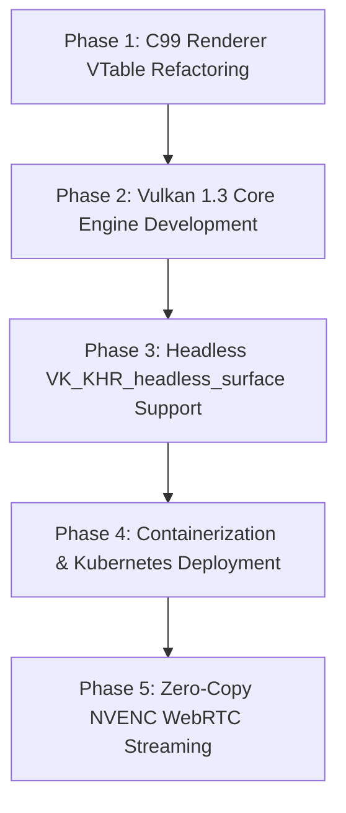

# Vulkan 1.3 Architecture, Hardware Exploitation & Kubernetes Cluster Deployment

**Project:** ZoniStation One — PSX Emulator (C99 / SDL2 / OpenGL 3.3 / Vulkan 1.3)  
**Date:** 2026-08-01  
**Target Hardware:** Intel Core i9 (24C/32T) + NVIDIA GeForce RTX 4060 & Kubernetes Clusters (K3s / k3d / EKS)  
**Companion Documents:** [`HARDWARE_UTILIZATION_ANALYSIS_2026-08-01.md`](file:///home/antoninoc/Projects/GitHub/ZonistationOne/docs/HARDWARE_UTILIZATION_ANALYSIS_2026-08-01.md), [`GPU_GAP_ANALYSIS_2026-07-15.md`](file:///home/antoninoc/Projects/GitHub/ZonistationOne/docs/GPU_GAP_ANALYSIS_2026-07-15.md).

---

> [!IMPORTANT]
> **Copyright, Licensing & Cleanroom Isolation Notice**  
> All architectural patterns described herein—including Vulkan 1.3 headless surfaces, NVENC zero-copy memory sharing, dynamic rendering, and Kubernetes pod orchestration—are based exclusively on **open industry standards** (Khronos Group Vulkan 1.3 Spec, NVIDIA Container Toolkit, CNCF Kubernetes Standards).  
> **Cleanroom Guarantee:** No proprietary code or reverse-engineered third-party implementations are used. All C99 Vulkan renderer code in ZoniStation One is written independently.

---

## 📑 Table of Contents

1. [Strategic Overview](#1-strategic-overview)
2. [Hardware Utilization: OpenGL 3.3 vs Vulkan 1.3](#2-hardware-utilization-opengl-33-vs-vulkan-13)
3. [Vulkan 1.3 Engine Deep Dive](#3-vulkan-13-engine-deep-dive)
   - [3.1 Dynamic Rendering (`VK_KHR_dynamic_rendering`)](#31-dynamic-rendering-vk_khr_dynamic_rendering)
   - [3.2 Semi-Transparency & Dual-Source Blending](#32-semi-transparency--dual-source-blending)
   - [3.3 PSX Bit 15 Masking & Stencil Operations](#33-psx-bit-15-masking--stencil-operations)
4. [Headless Kubernetes Cloud Streaming Architecture](#4-headless-kubernetes-cloud-streaming-architecture)
   - [4.1 Headless Offscreen Rendering (`VK_KHR_headless_surface`)](#41-headless-offscreen-rendering-vk_khr_headless_surface)
   - [4.2 Zero-Copy Hardware Video Encoding (NVENC + `VK_KHR_external_memory`)](#42-zero-copy-hardware-video-encoding-nvenc--vk_khr_external_memory)
   - [4.3 NVIDIA Container Toolkit & GPU Slicing / MPS](#43-nvidia-container-toolkit--gpu-slicing--mps)
   - [4.4 WebRTC / RTSP Low-Latency Streaming Pipeline](#44-webrtc--rtsp-low-latency-streaming-pipeline)
5. [C99 Modular Renderer Architecture (`RendererBackend`)](#5-c99-modular-renderer-architecture-rendererbackend)
6. [Resilient Cluster Orchestration & Stateful Emulation](#6-resilient-cluster-orchestration--stateful-emulation)
   - [6.1 Savestate Persistence & Cloud S3 / PVC Store](#61-savestate-persistence--cloud-s3--pvc-store)
   - [6.2 Liveness & Readiness Probes](#62-liveness--readiness-probes)
7. [Implementation Roadmap (5 Phases)](#7-implementation-roadmap-5-phases)
8. [Kubernetes Manifests & Production Dockerfile](#8-kubernetes-manifests--production-dockerfile)

---

## 1. Strategic Overview

ZoniStation One is a PlayStation 1 emulator written in C99, designed for high correctness, modularity, and cross-platform portability.

This document details the architecture required to:
1. **Abstract the GPU rendering pipeline** away from OpenGL 3.3 into a modular backend system.
2. **Implement a native Vulkan 1.3 engine** capable of high-resolution upscaling (2x to 8x), PGXP geometry stabilization, and ultra-low overhead execution on NVIDIA GPUs.
3. **Enable Cloud-Native Deployment on Kubernetes (K3s/k3d/EKS)** using headless offscreen rendering, allowing containerized emulator instances to run in cloud environments for cloud gaming, automated regression testing, and streaming.

---

## 2. Hardware Utilization: OpenGL 3.3 vs Vulkan 1.3

### 2.1 CPU & GPU Execution Comparison (i9-14900K + RTX 4060 Target)

```
CURRENT OPENGL 3.3 DESKTOP PIPELINE:
[Single CPU Core] ──(GL Driver Overhead)──> [OpenGL 3.3] ──> [RTX 4060: <1% Load, Native 1x FBO]

HEADLESS VULKAN 1.3 KUBERNETES PIPELINE:
[CPU Thread Pool] ──(Low-Overhead Command Buffers)──> [Vulkan 1.3] ──(Dynamic Rendering)──> [RTX 4060: Scaled 4K FBO]
                                                              │
                                                     (VK_KHR_external_memory)
                                                              ▼
                                                   [NVIDIA NVENC Zero-Copy]
                                                              │
                                                              ▼
                                                   [WebRTC Streamer Pod]
```

### 2.2 Performance & Utilization Matrix

| Feature / Metric | OpenGL 3.3 Backend (Current) | Vulkan 1.3 Engine (Target) | Cloud Headless Impact |
|---|---|---|---|
| **Display Dependency** | Requires X11 / Wayland / SDL2 Window | Supports `VK_KHR_headless_surface` | Operates in headless K8s pods without Xvfb |
| **Driver Overhead** | High single-thread OpenGL driver tax | Minimal overhead, multi-threaded command recording | Reclaims CPU headroom for JIT / SPU / MDEC |
| **Internal Resolution** | 1x Native PSX (1024×512 VRAM) | Configurable 1x to 8x (4K / 8K rendering) | Full RTX 4060 GPU utilization (~70-95%) |
| **Semi-Transparency** | Multi-pass blend emulation | Dual-source hardware blending (`src1Color`) | Single-pass PSX blend mode accuracy |
| **Video Streaming** | Host CPU RAM readback (`glReadPixels`) | Hardware zero-copy via `VK_KHR_external_memory` | Ultra-low latency NVENC H.264/HEVC/AV1 encoding |
| **Kubernetes Density** | 1 instance per host X11 display | Dozens of pods per GPU via NVIDIA MPS | Scalable multi-tenant cloud gaming |

---

## 3. Vulkan 1.3 Engine Deep Dive

### 3.1 Dynamic Rendering (`VK_KHR_dynamic_rendering`)
Vulkan 1.3 core includes `VK_KHR_dynamic_rendering`, eliminating the need for rigid `VkRenderPass` and `VkFramebuffer` boilerplates.

- **Execution Flow:** Render commands are recorded directly using `vkCmdBeginRendering` and `vkCmdEndRendering`.
- **Benefit:** Allows instant resolution scaling adjustments and dynamic target switching between native VRAM mirrors and upscaled offscreen FBOs without destroying pipeline state objects (PSOs).

### 3.2 Semi-Transparency & Dual-Source Hardware Blending
The PSX GPU supports 4 semi-transparency modes:
$$\text{Mode 0: } 0.5 \times B + 0.5 \times F$$
$$\text{Mode 1: } 1.0 \times B + 1.0 \times F$$
$$\text{Mode 2: } 1.0 \times B - 1.0 \times F$$
$$\text{Mode 3: } 1.0 \times B + 0.25 \times F$$

In Vulkan 1.3, this is implemented cleanly in a single pass using **Dual-Source Blending** (`src1Color` factor):
- The fragment shader outputs two colors: `location = 0` (pixel color) and `location = 1` (blend evaluation factor).
- The pipeline blend state is configured with `VK_BLEND_FACTOR_SRC1_COLOR` and `VK_BLEND_FACTOR_ONE_MINUS_SRC1_COLOR`, reproducing PSX hardware blending without expensive readback passes.

### 3.3 PSX Bit 15 Masking & Stencil Operations
PSX VRAM pixels use a 16-bit RGBA5551 format, where Bit 15 acts as a mask flag (`preserve_masked_pixels`, GP0 E6).
- **Vulkan Implementation:** The Vulkan backend maps Bit 15 to the Stencil Buffer bitmask (`VK_FORMAT_D24_UNORM_S8_UINT` or `VK_FORMAT_D32_SFLOAT_S8_UINT`).
- **Operation:** When drawing primitives with mask evaluation active, stencil testing discards or updates pixels based on the status of Bit 15, matching original hardware rasterization.

---

## 4. Headless Kubernetes Cloud Streaming Architecture

```
                                  KUBERNETES NODE (NVIDIA GPU HOST)
┌──────────────────────────────────────────────────────────────────────────────────────────────────┐
│                                                                                                  │
│   ┌──────────────────────────────────────────────────────────────────────────────────────────┐   │
│   │ POD: zonistation-emulator-01                                                             │   │
│   │                                                                                          │   │
│   │   [C99 Core] ──> [Vulkan 1.3 Engine] ──(Offscreen VkImage)──> [VK_KHR_external_memory]   │   │
│   │                                                                    │                     │   │
│   └────────────────────────────────────────────────────────────────────┼─────────────────────┘   │
│                                                                        │ (Zero-Copy CUDA IPC)    │
│                                                                        ▼                         │
│   ┌──────────────────────────────────────────────────────────────────────────────────────────┐   │
│   │ POD: nvenc-webrtc-streamer                                                               │   │
│   │                                                                                          │   │
│   │   [NVIDIA NVENC Hardware Encoder] ──> [Opus Audio] ──> [WebRTC / RTSP Low-Latency Engine]│   │
│   └────────────────────────────────────────────────────────────┬─────────────────────────────┘   │
│                                                                │                                 │
└────────────────────────────────────────────────────────────────┼─────────────────────────────────┘
                                                                 │ (RTP Stream < 20ms)
                                                                 ▼
                                                        [Remote Client Browser]
```

### 4.1 Headless Offscreen Rendering (`VK_KHR_headless_surface`)
In containerized environments without X11/Wayland:
- The Vulkan engine initializes using `VK_KHR_headless_surface` or directly creates swapchain-less `VkImage` render targets.
- Rendering occurs directly in GPU VRAM without window system dependencies.

### 4.2 Zero-Copy Hardware Video Encoding (NVENC + `VK_KHR_external_memory`)
To stream rendered frames to clients without staging data through host CPU RAM:
1. The Vulkan renderer allocates the render target `VkImage` with `VK_EXTERNAL_MEMORY_HANDLE_TYPE_OPAQUE_FD_BIT`.
2. The file descriptor (FD) is passed to the **NVIDIA NVENC SDK** via CUDA interop (`cudaImportExternalMemory`).
3. NVENC encodes H.264 / HEVC / AV1 video frames directly from GPU VRAM, achieving sub-millisecond encoding latencies.

### 4.3 NVIDIA Container Toolkit & GPU Slicing / MPS
Using **NVIDIA Multi-Process Service (MPS)** or GPU Time-Slicing in Kubernetes:
- A single host GPU (e.g., RTX 4060 or A10G) can be partitioned to run 10–20 concurrent ZoniStation One pod instances simultaneously with hardware acceleration.

### 4.4 WebRTC / RTSP Low-Latency Streaming Pipeline
- Video streams from NVENC are packetized into WebRTC (RTP/SRTP) frames.
- Audio from the SPU worker thread ([`spu_mixing.c`](file:///home/antoninoc/Projects/GitHub/ZonistationOne/src/spu/spu_mixing.c)) is encoded to Opus and synchronized with the video stream.

---

## 5. C99 Modular Renderer Architecture (`RendererBackend`)

To support both OpenGL 3.3 (desktop debugging) and Vulkan 1.3 (high performance & headless cloud) seamlessly, rendering is decoupled behind a C99 VTable interface in [`include/renderer.h`](file:///home/antoninoc/Projects/GitHub/ZonistationOne/include/renderer.h):

```c
#ifndef RENDERER_BACKEND_H
#define RENDERER_BACKEND_H

#include <stdint.h>
#include <stdbool.h>
#include <stddef.h>

typedef enum {
    RENDERER_BACKEND_OPENGL = 0,
    RENDERER_BACKEND_VULKAN
} RendererBackendType;

typedef struct {
    float x, y, z;
    uint8_t r, g, b, a;
    float u, v;
    uint16_t clut;
    uint16_t tpage;
} RendererVertex;

typedef struct {
    bool is_textured;
    bool is_raw_texture;
    bool semi_transparent;
    uint8_t blend_mode;
    uint16_t clut;
    uint16_t tpage;
} DrawState;

typedef struct RendererBackend {
    const char* name;
    bool (*init)(void* window_handle, bool headless, uint32_t scale_factor);
    void (*shutdown)(void);
    void (*begin_frame)(void);
    void (*end_frame)(void);
    void (*draw_polygons)(const RendererVertex* vertices, size_t count, const DrawState* state);
    void (*upload_vram)(uint16_t x, uint16_t y, uint16_t w, uint16_t h, const uint16_t* data);
    void (*read_vram)(uint16_t x, uint16_t y, uint16_t w, uint16_t h, uint16_t* out_data);
    void (*scanout)(uint16_t x, uint16_t y, uint16_t w, uint16_t h, bool depth24);
    void (*present)(void);
    void* (*get_native_texture_handle)(void); // For NVENC / External Memory Sharing
} RendererBackend;

// Global backend accessor
const RendererBackend* renderer_get_backend(RendererBackendType type);

#endif // RENDERER_BACKEND_H
```

---

## 6. Resilient Cluster Orchestration & Stateful Emulation

### 6.1 Savestate Persistence & Cloud S3 / PVC Store
When Kubernetes pods are rescheduled or scaled down:
- The emulator's RAM, GPRs, and hardware registers are serialized to a binary savestate snapshot.
- Snapshots are written to a Kubernetes Persistent Volume Claim (PVC) or uploaded to a MinIO / AWS S3 bucket.

### 6.2 Liveness & Readiness Probes
Pods expose an HTTP health endpoint (`/healthz`):
- **Readiness Probe:** Confirms Vulkan instance initialization and GPU allocation.
- **Liveness Probe:** Checks that the CPU emulation loop maintains frame pacing (< 16.6 ms per frame) and that the SPU audio ring buffer has not suffered underruns.

---

## 7. Implementation Roadmap (5 Phases)



1. **Phase 1: C99 Renderer VTable Refactoring:** Move OpenGL code to `src/gpu/renderer_gl.c` and establish `RendererBackend` VTable interface.
2. **Phase 2: Vulkan 1.3 Core Engine Development:** Implement `src/gpu/renderer_vk.c` with dynamic rendering, scaling FBOs, and dual-source blending.
3. **Phase 3: Headless Surface Mode:** Add `VK_KHR_headless_surface` support for windowless execution.
4. **Phase 4: Containerization & Kubernetes Deployment:** Package build in Docker containers with NVIDIA Container Toolkit integration.
5. **Phase 5: Zero-Copy NVENC Streaming:** Integrate `VK_KHR_external_memory` with NVENC for low-latency WebRTC cloud streaming.

---

## 8. Kubernetes Manifests & Production Dockerfile

### Production Dockerfile (`Dockerfile.vulkan`)

```dockerfile
FROM ubuntu:24.04 AS builder

ENV DEBIAN_FRONTEND=noninteractive
RUN apt-get update && apt-get install -y \
    build-essential \
    cmake \
    libsdl2-dev \
    libvulkan-dev \
    vulkan-tools \
    git \
    && rm -rf /var/lib/apt/lists/*

WORKDIR /app
COPY . .
RUN make clean && make USE_VULKAN=1

FROM ubuntu:24.04 AS runtime
ENV DEBIAN_FRONTEND=noninteractive

RUN apt-get update && apt-get install -y \
    libsdl2-2.0-0 \
    libvulkan1 \
    vulkan-tools \
    ca-certificates \
    && rm -rf /var/lib/apt/lists/*

ENV NVIDIA_VISIBLE_DEVICES=all
ENV NVIDIA_DRIVER_CAPABILITIES=graphics,utility,video,compute

WORKDIR /app
COPY --from=builder /app/zonistation_emu /app/zonistation_emu
COPY --from=builder /app/roms /app/roms

EXPOSE 8080 8443
ENTRYPOINT ["/app/zonistation_emu", "--vk-headless", "--scale=4", "/roms/SCPH1001.BIN"]
```

### Production Kubernetes Deployment Manifest (`k8s/deployment.yaml`)

```yaml
apiVersion: apps/v1
kind: Deployment
metadata:
  name: zonistation-vulkan-emulator
  namespace: default
  labels:
    app: zonistation-one
spec:
  replicas: 2
  selector:
    matchLabels:
      app: zonistation-one
  template:
    metadata:
      labels:
        app: zonistation-one
    spec:
      containers:
      - name: emulator
        image: zonistationone:vulkan-latest
        imagePullPolicy: IfNotPresent
        args: ["--vk-headless", "--scale=4", "--game=/games/game.cue", "/roms/SCPH1001.BIN"]
        env:
          - name: NVIDIA_VISIBLE_DEVICES
            value: "all"
          - name: NVIDIA_DRIVER_CAPABILITIES
            value: "graphics,utility,video,compute"
        resources:
          limits:
            nvidia.com/gpu: 1
            cpu: "4"
            memory: "4Gi"
          requests:
            cpu: "2"
            memory: "2Gi"
        livenessProbe:
          httpGet:
            path: /healthz
            port: 8080
          initialDelaySeconds: 5
          periodSeconds: 10
        readinessProbe:
          httpGet:
            path: /readiness
            port: 8080
          initialDelaySeconds: 3
          periodSeconds: 5
        volumeMounts:
          - name: game-storage
            mountPath: /games
          - name: rom-storage
            mountPath: /roms
      volumes:
        - name: game-storage
          persistentVolumeClaim:
            claimName: psx-games-pvc
        - name: rom-storage
          configMap:
            name: psx-bios-config
```
